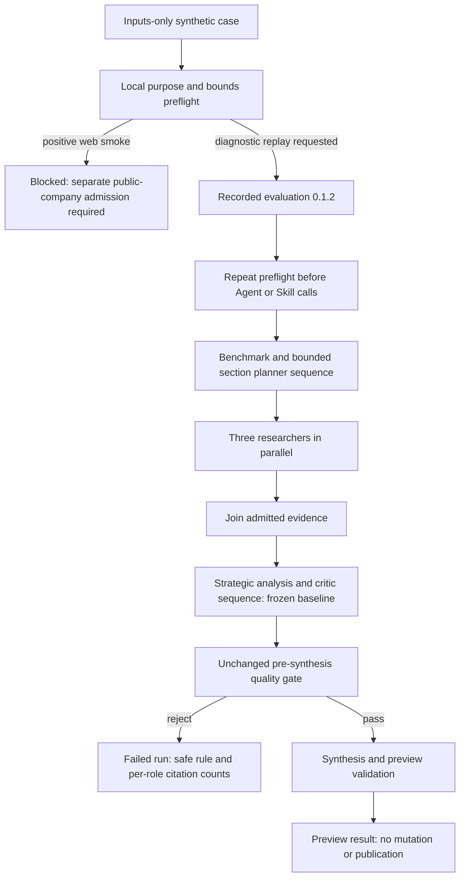

# Evaluation developer guide

## Role-scoped candidate (0.2.3)

The new source candidate addresses the measured headquarters overlap through a narrowed prompt/ownership contract. `company_identity` owns legal-name, headquarters, registered-address, incorporation and company-profile identity facts. `commercial_signals` requires explicit sales/customer markets, distribution territories, market access, revenue, commercial launches or commercialization/licensing activity. Identity-only geography requires a reviewed commercial `no_evidence` disposition. A commercial claim remains eligible when its quote also contains identity context.

`supplied_source_scoped_review.py` defines `supplied_source_methodology.v3` with the questions and requirement scopes included in its digest. Specialists receive only their assigned scopes; the existing local and global verifier stages receive the bound scopes as well. An out-of-scope claim is insufficient for its assigned requirement even if its words are source-supported. This remains model-assessed semantic authority: structural validation and canned-response tests cannot guarantee a noncompliant model will reject a misrouted claim. No quote-based or keyword-based semantic filter is introduced.

The source-owned `quote_review_orchestration.py` takes a trusted source-owned profile and reuses historical exact-quote/span and validation primitives. The old 0.2.2 orchestration file is unchanged. A legacy-profile parity regression compares complete results, packets, child calls and stage ordering, and a concurrent old/new regression proves profile selection does not mutate shared module globals. This permits later role-profile revisions to reuse one finite orchestrator.

Agent definitions for the new candidate:

| Role | Contract/chain version | Change |
| --- | --- | --- |
| `source_portfolio_reviewer` | `1.2.0` | Explicit ownership of company-profile identity |
| `source_commercial_reviewer` | `1.2.0` | Explicit commercial activity; identity-only abstention |
| `source_regulatory_reviewer` | `1.1.0` | Exact historical definition retained |
| `source_evidence_verifier` | `1.1.0` | Bound ownership rules in local/global checks |

Provider/model, generation settings, timeouts, budgets, no-store policies and tool permissions are unchanged. The existing toolkit `0.1.1 / resolve_exact_spans`, one child per chunk, four-chunk ceiling, three parallel specialists, `4N + 1` Agent ceiling (maximum 17), 1,800-second deadline and zero repair iterations remain in effect. Output/result and scalar-summary schemas remain v2; only the methodology identity and candidate identity change.

Select `--candidate-version 0.2.3` for the existing offline projector and evaluator. `development_input_bindings.v3.json` pins the same suite and source bytes to the new asset identity. The original 0.2.1 CLI default and old bindings remain unchanged. A historical 0.2.2 result/review cannot be relabelled as 0.2.3 evidence; exact candidate, methodology, plan and span receipts are checked. A new independent review is required after an admitted retained run. Do not send the reviewer decisions or expected fixture answers to any Agent.

### Official workflow promotion

This source change does not upgrade the Python runtime package, manually bump its version, build/install a local wheel, restart a worker or modify an env file. After reviewing and merging the intake PR, dispatch the existing Assets workflow against its exact merge commit. This creates a separately reviewable packaged Assets PR; it does not deploy.

```powershell
$IntakePr = gh pr view 85 --repo pipharmaintelligence/adapter-intake --json state,mergeCommit | ConvertFrom-Json
if ($IntakePr.state -ne 'MERGED' -or -not $IntakePr.mergeCommit.oid) {
    throw 'Merge the reviewed intake PR before promotion.'
}
$IntakeRef = $IntakePr.mergeCommit.oid
gh workflow run adapter-intake-promote-pr.yml `
    --repo piusaibah/assets `
    --ref main `
    -f intake_repository=pipharmaintelligence/adapter-intake `
    -f intake_ref=$IntakeRef `
    -f intake_adapter_yaml=adapters/nusaibah/pharma_company_intelligence_lab_evaluation/adapter.yaml `
    -f base_branch=main `
    -f draft=false `
    -f allow_manifest_removals=false
if ($LASTEXITCODE -ne 0) { throw 'Official promotion dispatch failed.' }
```

Verify materialization, both catalog publications and package validation in that workflow before reviewing the generated Assets PR. After its review/merge, verify the exact packaged 0.2.3 identity and module hashes, the existing toolkit identity, and the exact Agent versions above using the established admission/worker path. Source readiness alone does not authorize a provider run. Keep the next live case pending until those delivery/admission gates and its scope are reviewed; WP1 remains incomplete.

## Quote-selection candidate (0.2.2)

This section records the historical 0.2.2 contract and delivery. Current 0.2.3 promotion instructions are above.

This source-owned development version addresses model-offset arithmetic without weakening evidence checks. Specialists return `supplied_source_specialist.v2` with exact `locator`/`quote` pairs only. Extra `start`/`end` or the old specialist schema rejects before the child call. The orchestrator validates every specialist's closed proposal, makes one signed callable `review_toolkit` call per chunk to `nusaibah.structured_review_toolkit:0.1.1 / resolve_exact_spans`, checks its bound result, and only then builds canonical integer spans for strict validation and local semantic verification.

The resolver returns `resolved` or a closed `rejected` outcome. Missing or ambiguous quotes stop with `evidence_quote_missing` / `evidence_quote_ambiguous` in safe `proof_failure_detail`; no raw response text or offsets are logged. No partial span batch, fuzzy matching, whitespace/Unicode normalization, first-occurrence selection or quote invention is allowed. Valid-looking exact quotes still require semantic support, textual entity attribution, context/qualifier checks, global consistency and independent quality review. This contract does not silently repair historical 0.2.1 responses.

The unchanged source parser freezes the exact snapshot and intact related context. New `supplied_source_methodology.v2` and `supplied_source_plan.v2` identify the resolver version/operation and finite child budget. Maximum four chunks, 6,000 characters per chunk, three specialists in parallel, `4N + 1` logical Agent ceiling (maximum 17), one child per chunk (maximum four), 16 span requests per chunk, 1,800-second deadline and zero repair iterations. Call charges occur before execution. Runtime retry/cancellation/admission remains generic; the parent cannot enlarge a signed child budget.

Specialist Agent chain/contracts use **1.1.0**; their provider/model/generation/timeouts/budgets and no-store policies are unchanged. The semantic verifier remains **1.0.0**, including its definition. The model may not invoke tools; the deterministic call belongs to trusted Python orchestration. All historical adapter modules, the frozen baseline executor and historical manifest version definitions remain unchanged.

Outputs are `supplied_source_review_result.v2` and `pharma_supplied_source_review_summary.v2`. The full result adds `child_call_count`, `toolkit_identity` and one bound `span_resolution_receipts` entry per chunk. Each receipt retains the tool result/request digest, source digest, ordered request IDs and literal spans, including evidence for withheld findings. It does not retain complete prompts or unbounded provider responses. The scalar summary adds only the child count; no source/model text enters that projection. Missing full preview bytes still prevent quality scoring.

The offline projector/evaluator keep their explicit **0.2.1 default**. Select `--candidate-version 0.2.2` to use `development_input_bindings.v2.json`, the new canonical plan and the v2 result schemas. Input source bytes and adjudication do not change; the candidate/methodology and finite plan do. Review templates pin the chosen asset, method, source, input and retained-result identities. The evaluator verifies span-receipt completeness, literal uniqueness, source/request binding, accepted/withheld accounting and child count. Mixed candidate versions or methods cannot form one measured batch. Held-out admission, thresholds, domain scope approval and baseline readiness remain separate gates.

After this source PR is merged, prepare a new offline batch from E: main. This command does not load an env file or invoke OBS/providers:

```powershell
$ProjectRoot = 'E:\nusaibah_projects\demo_asset_project'
$IntakeRoot = "$ProjectRoot\adapter-intake-work"
$Python = "$ProjectRoot\.venv\Scripts\python.exe"
$Projector = "$IntakeRoot\adapters\nusaibah\pharma_company_intelligence_lab\tests\evaluation\project_development_inputs.py"
$BatchRoot = Join-Path "$ProjectRoot\runtime-artifacts" ('wp1-quote-inputs-' + (Get-Date -Format 'yyyyMMdd-HHmmss'))
& $Python $Projector `
  --candidate-version 0.2.2 `
  --case-id company-small-identity-001 `
  --case-id company-wrong-entity-005 `
  --case-id company-source-injection-006 `
  --case-id company-missing-evidence-007 `
  --case-id company-conflicting-dates-003 `
  --output-dir $BatchRoot `
  --pretty
if ($LASTEXITCODE -ne 0) { throw 'Stop: quote-candidate projection is blocked.' }
```

`prepared` proves compatibility, with `execution_allowed=false`, `wp1_complete=false`, `wp2_unblocked=false`. The new batch requires the same pending scope/binding review. Do not relabel the first failed 0.2.1 run, use old smoke outputs as this fixture, or fabricate a review receipt.

Release sequence: merge source → official promotion of **both** toolkit 0.1.1 and evaluation 0.2.2 from the same exact commit → review/merge the generated Assets promotion → passed complete wheel and installed module/helper/catalog checks → owned idle worker replacement → exact registration/binding and four-role Agent admission → approved single-case diagnostic execution → retain original preview/usage → independent semantic review and offline evaluation. No manual wheel-version bump, source-only patch to Assets, new env values or S3 changes are part of this repair. The active worker cannot discover these versions merely because source tests pass.

After an admitted new run produces original retained bytes, use the existing evaluator commands with `--candidate-version 0.2.2` for template emission and scoring. A typed rejected run produces no completed preview; preserve its rule and stop before other cases. A successful preview establishes execution, not calibrated quality or WP1 completion. The original unknown subcause of the failed 0.2.1 commercial span remains unknown; invented/ambiguous quotes deliberately remain blockers.

## Commercial role ownership evidence

See [COMMERCIAL_ROLE_SCOPE.md](COMMERCIAL_ROLE_SCOPE.md) for the measured overlap, original offline proposal, implemented 0.2.3 source contract and regressions. Scripted response fixtures remain test-side only. Source preparation and candidate scoring stay separate from promotion, admission and live semantic review. Historical 0.2.2 questions/digests are preserved, and shared-span regressions prevent an unsafe quote-based deduplication shortcut.

## Three distinct proof lanes

| Lane | Evidence and authority | What completion proves |
| --- | --- | --- |
| Synthetic baseline diagnostics | Synthetic source units; pinned 0.1.12 roles; preview; no mutation/publication | Executed or classified rejected review. It does not establish a positive dossier or WP1 quality measurements. |
| Positive public-web smoke | Separate reviewed public-company identity/admission and runtime-owned execution | All baseline evidence/quality requirements pass and no writes occur. This lane is not admitted by the synthetic-only evaluation asset. |
| Supplied-source development review | Versioned source/reference contract, specialist work and evidence-gap outcomes | Findings refer to admitted supplied sources; 0.2.2 delegates exact offsets to a deterministic toolkit. This is separate from frozen 0.1.2 replay and independent quality measurement. |

Projection compatibility means bounded inputs fit the frozen executor. It does not establish positive-smoke eligibility. The small identity fixture describes a fictional company; replay searches under `WP1 Synthetic Evaluation company-small-identity-001`. The suite permits complete-with-evidence-gaps outcomes, while frozen 0.1.12 requires provider citations from every research specialist. Preserve the fixture/adjudication and correct the acceptance design; never invent sources or force pass.

## Explicit purpose and no-provider preflight

Evaluation 0.1.2 requires `variables.case_index` (0–23) and `variables.execution_purpose=diagnostic_baseline_replay`. Other input roles remain `evaluation_case.records` with exactly one bounded company-research case. Old 0.1.0/0.1.1 remain historical identities without this guard.

Run from the reviewed source checkout after the source PR is merged:

```powershell
$ProjectRoot = "E:\nusaibah_projects\demo_asset_project"
$IntakeRoot = "$ProjectRoot\adapter-intake-work"
$Python = "$ProjectRoot\.venv\Scripts\python.exe"
$Preflight = "$IntakeRoot\adapters\nusaibah\pharma_company_intelligence_lab_evaluation\evaluation_preflight.py"
$InputsFile = "$ProjectRoot\runtime-artifacts\pharma-evaluation-0.1.0-company-small-identity-001.inputs.json"

& $Python $Preflight --inputs-file $InputsFile --purpose positive_web_smoke
```

This intentionally returns exit code 2, `execution_allowed=false` and `positive_web_smoke_requires_separate_admission`. Do not launch that request. No provider, OBS, Core or Skill call occurs.

If a diagnostic replay is explicitly wanted, create separate inputs without altering the historical fixture:

```powershell
$DiagnosticInputs = "$ProjectRoot\runtime-artifacts\pharma-evaluation-0.1.2-company-small-identity-001.diagnostic.inputs.json"
$Payload = Get-Content -LiteralPath $InputsFile -Raw | ConvertFrom-Json
$Payload.variables | Add-Member -NotePropertyName execution_purpose -NotePropertyValue diagnostic_baseline_replay -Force
$Payload | ConvertTo-Json -Depth 30 | Set-Content -LiteralPath $DiagnosticInputs -Encoding utf8

& $Python $Preflight --inputs-file $DiagnosticInputs
if ($LASTEXITCODE -ne 0) { throw "Evaluation preflight blocked execution." }
```

A ready diagnostic preflight permits the replay; it does not predict quality acceptance. The adapter repeats the guard before Agent/Skill access. Classified quality rejection remains failure.

Bounds: one case; at most fourteen source units within 48 baseline fields; 4,000 characters per source text; at most twenty flags per unit with bounded safe identifiers; no extra case/source/variable fields. Synthetic locators follow `kind:identifier`; web URLs are not source locators in this lane. The CLI bounds its input read to 128 KiB. Document mode, truth fields, caller authority and unknown purpose are blocked without calls.

## Deploy one coherent artifact

1. Merge the adapter-intake source PR first.
2. Review the companion Assets PR containing generic diagnostics and generated materialization from the exact reviewed source commit. Production 0.1.12 business files remain unchanged.
3. Build/inspect the final wheel/sdist and fresh catalog. Verify evaluation 0.1.2 resolves and the generic citation observation module exists. A wheel version alone is insufficient.
4. Deploy PHP receipt validation and safe status/result projection before a worker that emits the observation field.
5. Install the exact final CI wheel in the approved E: virtual environment, record hash/catalog generation, restart the worker using the existing documented helper and verify health/resolution.
6. Register/admit evaluation 0.1.2 with unchanged Agent contracts and pinned Fixed Skill. 0.1.1 registration does not prove 0.1.2 admission.
7. Save preflight evidence. Launch one diagnostic replay only when explicitly requested, stop at its classified outcome, and retain counts/usage plus independent no-write proof.

No new .env values are required. The client env-file does not reconfigure PHP or an existing worker. A positive/no-write acceptance gate remains open pending separate reviewed admission; diagnostic execution does not authorize the remaining ten cases or prove all-24 WP1 completion.

## Read safe citation observations

Generic runtime `agent_citation_observation.v1` records all preserved accepted provider turns, recognized citation-schema turns, trusted search-request indication, provider-reported query count, native web-grounding/explicit-citation counts, and deduplicated admitted citation count.

Projection status distinguishes `projected`, `partial`, `unsupported` and `invalid`. Unsupported/invalid admitted counts are null, not zero. A partial count covers recognized turns only. Missing query metadata is unknown. Search requested does not prove search execution; native counts do not prove source relevance or claim support. No queries, URLs, titles, prompts or response text enter the observations.

Signed receipts retain these counts if a later adapter quality gate fails. Status/result APIs and smoke output return `agent_citation_summary`, identifying the research role with empty evidence. Old runs without observations remain unavailable. Receipt inspection is bounded to 1,024 accepted turns; public summaries scan at most 4,096 batches/receipts and expose at most 256 observations.

## Priorities for future specialized review

1. **Quality and precision:** explicit source identity and claim-to-source references; abstain when unsupported.
2. **Controlled work:** source/section ownership, finite chunk sizes, role/call ceilings, deadlines and cleanup. No unbounded repair loops.
3. **Specialization:** section-local work; parallel independent chunks; deterministic join followed by critic and synthesis.
4. **Hallucination control:** isolate wrong-entity distractors, retain uncertainty, and separate factual evidence from procedural methodology memory.
5. **Efficiency:** pass the smallest admitted context each specialist needs. In a new production version, stop after research when mandatory evidence is already absent.

Do not change frozen 0.1.12 prompts, policies, model/thinking/token settings, topology or thresholds to implement these priorities. New capability needs a versioned contract, adjudicated tests and a comparability decision. The thirteen document cases remain not executable against 0.1.12.

## Execution model



Existing finite limits remain: twelve preview logical calls per company, four planner iterations, three transport attempts per step, 1,800-second task deadline and separate 60-second cleanup budget. No retry or repair loop is added.


## Separate supplied-source lane 0.2.0

See [SUPPLIED_SOURCE_REVIEW.md](SUPPLIED_SOURCE_REVIEW.md) for strict inputs, exact-span and semantic verification, source/requirement coverage, finite 17-call topology, no-provider preflight and deployment commands. This new synthetic preview disables search and accepts reviewed evidence gaps. It does not change the frozen citation gate or satisfy WP1 comparability. Use a new inputs-only JSON and admit the new Agent contracts. No new environment values, mutations, publication or real document authority are introduced.


## Result visibility in evaluation 0.2.1

Version 0.2.1 reuses the 0.2.0 supplied-source review engine and Agent contracts unchanged. Its required `evaluation_summary` object contains only the actual outcome, execution state, call and finding counts, and preview/publication/comparability flags. Source text, findings, evidence spans, case IDs, and entity IDs remain outside this summary.

Inspect the authorized result with `--output-role evaluation_summary`. This bounded projection is not full findings or independent external truth. `review_complete_with_evidence_gaps` remains a completed review with gaps; no quality gate is weakened.

Original evaluation versions and frozen production 0.1.12 replay remain available. Register/admit the exact new version after official Assets promotion, then verify the installed wheel catalog resolves 0.2.1. An old completed 0.2.0 run cannot acquire a business summary retroactively.

Future full-preview inspection requires explicit governed Core retention and authorized reference reads. Never copy source documents into PHP checkpoints or interpret workflow-state archives as full business results.

## Adjudicated development input preparation

The source-only [development projector workflow](../pharma_company_intelligence_lab/tests/evaluation/README.md#prepare-exact-development-inputs-first) now exports exact 0.2.1 inputs for an explicit finite proposed case set and runs the unchanged source/evaluator preflight. It needs no env file, runtime update or provider execution. Preserve its manifest and exact input/suite bytes for PR80's independent retained-result evaluation. Existing output directories are never reused; source fixtures and production adapters remain unchanged.

Read the [WP1 scope/comparability proposal](../../../docs/reviews/WP1-Scope-and-Comparability-Decision.v1.md) before interpreting `status=prepared`. Source compatibility does not grant execution or establish quality. Keep the legacy baseline incomplete, held-out truth sealed and dependent WP gates closed until the approved measurement/scope contract supplies the required evidence. Generic deterministic-tool integration and data/storage authority retain their existing owners.
