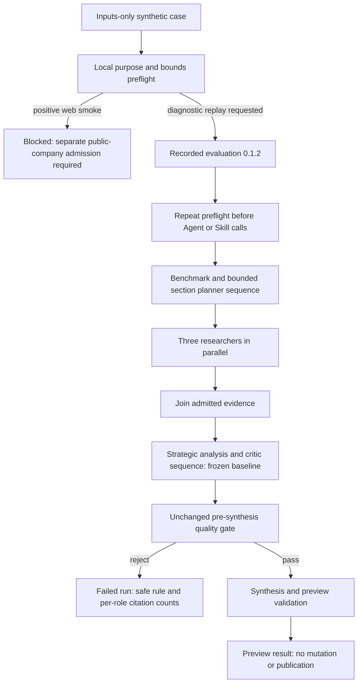

# Evaluation developer guide

## Three distinct proof lanes

| Lane | Evidence and authority | What completion proves |
| --- | --- | --- |
| Synthetic baseline diagnostics | Synthetic source units; pinned 0.1.12 roles; preview; no mutation/publication | Executed or classified rejected review. It does not establish a positive dossier or WP1 quality measurements. |
| Positive public-web smoke | Separate reviewed public-company identity/admission and runtime-owned execution | All baseline evidence/quality requirements pass and no writes occur. This lane is not admitted by the synthetic-only evaluation asset. |
| Future supplied-source review | New source/reference contract, specialist work and evidence-gap outcomes | Findings refer to admitted supplied sources. This capability is not implemented by 0.1.2. |

Projection compatibility means bounded inputs fit the frozen executor. It does not establish positive-smoke eligibility. The small identity fixture describes a fictional company; replay searches under `WP1 Synthetic Evaluation company-small-identity-001`. The suite permits complete-with-evidence-gaps outcomes, while frozen 0.1.12 requires provider citations from every research specialist. Preserve the fixture/adjudication and correct the acceptance design; never invent sources or force pass.

## Explicit purpose and no-provider preflight

Evaluation 0.1.2 requires `variables.case_index` (0–23) and `variables.execution_purpose=diagnostic_baseline_replay`. Other input roles remain `evaluation_case.records` with exactly one bounded company-research case. Old 0.1.0/0.1.1 remain historical identities without this guard.

Run from the reviewed source checkout after the source PR is merged:

```powershell
$ProjectRoot = "E:\nusaibah_projects\demo_asset_project"
$IntakeRoot = "$ProjectRoot\adapter-intake-work"
$Python = "$ProjectRoot\.venv\Scripts\python.exe"
$Preflight = "$IntakeRoot\adapters\nusaibah\pharma_company_intelligence_lab_evaluation\evaluation_preflight.py"
$InputsFile = "$ProjectRoot\runtime-artifacts\pharma-evaluation-0.1.0-company-small-identity-001.inputs.json"

& $Python $Preflight --inputs-file $InputsFile --purpose positive_web_smoke
```

This intentionally returns exit code 2, `execution_allowed=false` and `positive_web_smoke_requires_separate_admission`. Do not launch that request. No provider, OBS, Core or Skill call occurs.

If a diagnostic replay is explicitly wanted, create separate inputs without altering the historical fixture:

```powershell
$DiagnosticInputs = "$ProjectRoot\runtime-artifacts\pharma-evaluation-0.1.2-company-small-identity-001.diagnostic.inputs.json"
$Payload = Get-Content -LiteralPath $InputsFile -Raw | ConvertFrom-Json
$Payload.variables | Add-Member -NotePropertyName execution_purpose -NotePropertyValue diagnostic_baseline_replay -Force
$Payload | ConvertTo-Json -Depth 30 | Set-Content -LiteralPath $DiagnosticInputs -Encoding utf8

& $Python $Preflight --inputs-file $DiagnosticInputs
if ($LASTEXITCODE -ne 0) { throw "Evaluation preflight blocked execution." }
```

A ready diagnostic preflight permits the replay; it does not predict quality acceptance. The adapter repeats the guard before Agent/Skill access. Classified quality rejection remains failure.

Bounds: one case; at most fourteen source units within 48 baseline fields; 4,000 characters per source text; at most twenty flags per unit with bounded safe identifiers; no extra case/source/variable fields. Synthetic locators follow `kind:identifier`; web URLs are not source locators in this lane. The CLI bounds its input read to 128 KiB. Document mode, truth fields, caller authority and unknown purpose are blocked without calls.

## Deploy one coherent artifact

1. Merge the adapter-intake source PR first.
2. Review the companion Assets PR containing generic diagnostics and generated materialization from the exact reviewed source commit. Production 0.1.12 business files remain unchanged.
3. Build/inspect the final wheel/sdist and fresh catalog. Verify evaluation 0.1.2 resolves and the generic citation observation module exists. A wheel version alone is insufficient.
4. Deploy PHP receipt validation and safe status/result projection before a worker that emits the observation field.
5. Install the exact final CI wheel in the approved E: virtual environment, record hash/catalog generation, restart the worker using the existing documented helper and verify health/resolution.
6. Register/admit evaluation 0.1.2 with unchanged Agent contracts and pinned Fixed Skill. 0.1.1 registration does not prove 0.1.2 admission.
7. Save preflight evidence. Launch one diagnostic replay only when explicitly requested, stop at its classified outcome, and retain counts/usage plus independent no-write proof.

No new .env values are required. The client env-file does not reconfigure PHP or an existing worker. A positive/no-write acceptance gate remains open pending separate reviewed admission; diagnostic execution does not authorize the remaining ten cases or prove all-24 WP1 completion.

## Read safe citation observations

Generic runtime `agent_citation_observation.v1` records all preserved accepted provider turns, recognized citation-schema turns, trusted search-request indication, provider-reported query count, native web-grounding/explicit-citation counts, and deduplicated admitted citation count.

Projection status distinguishes `projected`, `partial`, `unsupported` and `invalid`. Unsupported/invalid admitted counts are null, not zero. A partial count covers recognized turns only. Missing query metadata is unknown. Search requested does not prove search execution; native counts do not prove source relevance or claim support. No queries, URLs, titles, prompts or response text enter the observations.

Signed receipts retain these counts if a later adapter quality gate fails. Status/result APIs and smoke output return `agent_citation_summary`, identifying the research role with empty evidence. Old runs without observations remain unavailable. Receipt inspection is bounded to 1,024 accepted turns; public summaries scan at most 4,096 batches/receipts and expose at most 256 observations.

## Priorities for future specialized review

1. **Quality and precision:** explicit source identity and claim-to-source references; abstain when unsupported.
2. **Controlled work:** source/section ownership, finite chunk sizes, role/call ceilings, deadlines and cleanup. No unbounded repair loops.
3. **Specialization:** section-local work; parallel independent chunks; deterministic join followed by critic and synthesis.
4. **Hallucination control:** isolate wrong-entity distractors, retain uncertainty, and separate factual evidence from procedural methodology memory.
5. **Efficiency:** pass the smallest admitted context each specialist needs. In a new production version, stop after research when mandatory evidence is already absent.

Do not change frozen 0.1.12 prompts, policies, model/thinking/token settings, topology or thresholds to implement these priorities. New capability needs a versioned contract, adjudicated tests and a comparability decision. The thirteen document cases remain not executable against 0.1.12.

## Execution model



Existing finite limits remain: twelve preview logical calls per company, four planner iterations, three transport attempts per step, 1,800-second task deadline and separate 60-second cleanup budget. No retry or repair loop is added.
