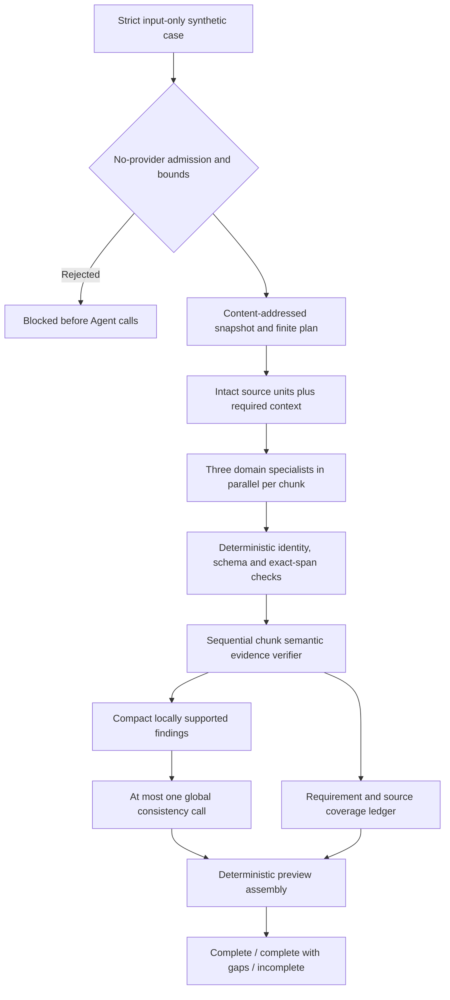

# Supplied-source company review 0.2.0

## Objective

A controlled synthetic review can finish with evidence gaps when provided text has no support. Zero provider web citations is expected: search is disabled and accepted findings cite inspected supplied spans. No accessible target source text blocks preflight. A URL, model memory, citation count or fabricated quotation cannot substitute for inspected evidence.

This is a **new development preview contract**, not frozen 0.1.12 replay. Versions 0.1.0–0.1.2 and their citation/quality gates remain unchanged. Version 0.2.0 reports `baseline_comparable=false` and must not enter the WP1 baseline scorer. Full PI-1972 work-package and model-quality gates remain open.

## System context

Business behavior lives in adapter-intake; Assets materializes the exact reviewed commit and owns packaging and generic enforcement. Core owns Agent admission, credential resolution and provider policy. The adapter calls only `RuntimeInputs.invoke_agent`, without APIs, SDKs, storage, database, publication or mutable Skill access.

Scope is **focused synthetic company review of already supplied text**. Real document/file binding, extraction, governance/S3 logic, production activation and full-document coverage are absent. Caller source/entity labels are context; the verifier must separately check textual target attribution.

The pinned application-owned `supplied_source_methodology.v1` defines company identity, portfolio, commercial, and regulatory/clinical/safety questions. Its digest is in the finite plan. This small method is separate from the published Fixed Skill; it is not completion of all WP2–WP10 contracts.

## Approach and clear model



Process chunks in input order. Join each chunk's three specialists deterministically before verification and the next chunk. Specialists receive only their domain questions and current source unit plus required context. Conservatively review each target unit in all domains so a classifier cannot silently exclude critical evidence. Inventory other entity units as excluded and never send them to Agents.

The chunk verifier sees the whole bounded chunk and proposed findings. It checks entailment, attribution, dates, jurisdiction, negation, qualifiers and contradictions, and independently flags omitted relevant evidence. Exact quote matching proves provenance, not meaning. The final consistency call receives compact locally supported claims and cannot introduce, rewrite or promote a finding. Assembly preserves exact verified statements; no free-form synthesizer introduces facts.

## Input contract

`variables` has only `execution_purpose=supplied_source_review`. `evaluation_case` has one `records` entry with exactly these fields:

```json
{
  "variables": {"execution_purpose": "supplied_source_review"},
  "evaluation_case": {
    "records": [{
      "case_id": "synthetic-source-review-001",
      "mode": "supplied_source_review",
      "synthetic": true,
      "entity_id": "ficta",
      "entity_name": "Ficta Therapeutics",
      "source_units": [
        {"locator": "source:identity", "entity_id": "ficta",
         "text": "Ficta Therapeutics is a synthetic company."},
        {"locator": "source:distractor", "entity_id": "other",
         "text": "Other Company has a fictional product."}
      ]
    }]
  }
}
```

Source units require `locator`, `entity_id` and `text`; optional `accessible` is a boolean and `related_locators` lists at most three existing locators of the same declared entity. Evidence offsets are zero-based Unicode code points, start inclusive/end exclusive, within unchanged unit text.

Use a new inputs-only JSON. Baseline `case_index`/`diagnostic_baseline_replay` inputs are deliberately incompatible. Expected findings, held-out truth, thresholds, reviewer notes, provider references, credentials, publication requests and unknown fields are rejected.

Snapshot/chunk IDs hash exact input identity, text, accessibility and context. Units and transitive required context remain intact; qualifier cycles are resolved with at most 12 iterations and each locator is included once. Oversized context blocks before calls instead of truncating; missing/cross-entity context is rejected. Inaccessible units remain in coverage; an entirely inaccessible target cannot execute.

## Evidence and outcomes

| Situation | Result |
| --- | --- |
| No provider web citations | Expected; does not block this lane |
| Accessible text but no relevant findings | May finish `review_complete_with_evidence_gaps` after verifier coverage checks |
| Fabricated span/locator or invalid schema/identity | Fail closed with safe stage/rule |
| Unsupported, wrong-entity or contradictory finding | Withhold its statement; retain identity and disposition only |
| Global conflict or uncertainty | Withhold affected locally supported findings |
| Unreviewed requirement or omitted evidence | `review_incomplete`; withhold all findings from that chunk |
| Inaccessible target unit alongside executable units | `review_incomplete` with source disposition |
| No accessible target sources | Block before providers |

`execution_state=completed` means the finite execution finished; `review_outcome` describes review completeness/evidence. Runtime success can contain an incomplete business preview. Consumers must inspect the outcome instead of treating successful HTTP execution as release approval.

`review_complete` requires all target work reviewed, no omissions/inaccessibility or withheld findings, and accepted support for every domain obligation. `review_complete_with_evidence_gaps` permits reviewed obligations without support. Every material claim uses the same withholding rule; no uncalibrated critical taxonomy is invented.

Accepted findings preserve entity/snapshot/chunk identity, requirement, exact evidence spans and digest-bound verdicts. `provenance_strength=inspected_supplied_span` and `external_truth_verified=false` mean support within provided text, not independent public verification. All outcomes remain `preview_only=true`, `publication_allowed=false`, with zero mutable calls.

Semantic judgments are model-assessed. Contract tests do not prove factual accuracy or resistance to every injection. Domain-adjudicated quality evaluation remains required before broader rollout.

## Finite controls

| Control | Hard maximum |
| --- | --- |
| Input JSON/file | 128 KiB |
| Source units, including excluded/inaccessible | 12 |
| Individual unit / intact chunk with context | 6,000 Unicode characters |
| Combined source text | 24,000 characters |
| Executable target chunks | 4 |
| Concurrent specialist calls | 3 |
| Findings per requirement / references per finding | 2 / 2 |
| Statement / quote | 600 characters each |
| Encoded Agent packet / business response | 128 KiB / 64 KiB |
| Logical calls | Four per chunk + at most one global call; maximum 17 |
| Repair/regeneration loops | Zero |
| Adapter/task deadline | 1,800 seconds |

Runtime owns retries, concurrency admission, cancellation, hard timeout and cleanup. Adapter checks the deadline before/after calls and before another chunk. It cannot interrupt an already running synchronous helper; runtime cancellation remains authoritative. Exhaustion never produces false completion.

Four new immutable Agent contracts each use one JSON provider step, search disabled and zero tools, with the existing provider-vault boundary. Historical chains and token ceilings remain unchanged. Usage comes from actual receipts; missing usage stays unknown.

## Validation and deployment direction

1. Run source promotion-shape, evaluation and frozen production-parity suites. Offline doubles establish controls, not model quality.
2. Officially materialize the exact source commit in Assets; publish manifests/catalogs, build and inspect/scan wheel/sdist, then verify clean installed-wheel identity discovery.
3. Review and merge source and packaging PRs; install the final matching CI artifact. Runtime 0.1.100 does not contain evaluation 0.2.0.
4. Register the exact new version and admit its four new search-disabled Agent contracts through existing Assets/Core tools. Historical Agent admission is insufficient.
5. Reload compatible long-running PHP consumers and restart the Python worker after installing its wheel. Verify process environment, health and trusted runtime source selection. Client `--env-file` does not redefine an existing server/worker environment.
6. Preflight the new JSON without providers. Only after exact admission/worker proof, run one synthetic preview; classify a failure before launching more work. Inspect review outcome, source spans, actual usage and no-write evidence.
7. Keep this preview separate from baseline scores, positive frozen web smoke, all-24 WP1 measurement and the 13 unimplemented document cases. Do not mark WP1–WP10 complete.

**No new .env values.** No install, registration, worker restart, paid preview or production activation occurs merely through creating these PRs.

## PowerShell after reviewed installation and admission

Create the new inputs-only JSON using the example above.

```powershell
$ProjectRoot = "E:\nusaibah_projects\demo_asset_project"
$Python = "$ProjectRoot\.venv\Scripts\python.exe"
$InputsFile = "$ProjectRoot\runtime-artifacts\synthetic-source-review-0.2.0.inputs.json"

& $Python -m adapters.intake.nusaibah.pharma_company_intelligence_lab_evaluation.supplied_source_review `
    --inputs-file $InputsFile

& "$ProjectRoot\.venv\Scripts\obs-asset-runtime-smoke.exe" `
    --env-file "$ProjectRoot\.env" `
    --entity-key "nusaibah.pharma_company_intelligence_lab_evaluation" `
    --asset-key "nusaibah.pharma_company_intelligence_lab_evaluation" `
    --asset-version "0.2.0" `
    --execution-substrate "local_worker" `
    --route "agent" `
    --mode "balanced" `
    --inputs-file $InputsFile `
    --poll-timeout 2100 `
    --poll-interval 3 `
    --include-safe-result `
    --pretty
```

Larger documents, richer methodology, semantic calibration and operator presentation remain separately gated future work.
