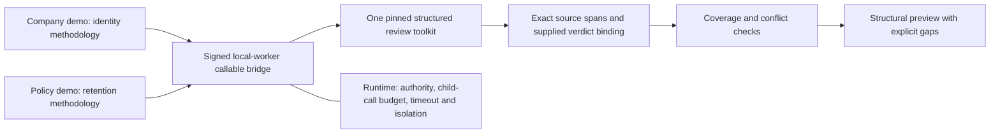

# Structured review toolkit

Development version: `nusaibah.structured_review_toolkit:0.1.0`.

One deterministic callable asset serves multiple review domains. Consumers select a reviewed operation and supply source/methodology data; they do not copy the utility implementation. The company and policy demos both invoke this exact toolkit version.

Data processing belongs in `prepare_sources`, evidence/coverage checks, reconciliation and assembly. Selection belongs in `prepare_packet`. Execution controls belong to the runtime; no operation adds a loop, retry controller or scheduler.

## Operations

| Operation | Purpose |
| --- | --- |
| `prepare_sources` | Immutable source inventory and bounded structure-aware chunks, including transitive table/header/footnote dependencies |
| `prepare_packet` | Relevant specialist context with selected memory and omitted-context reasons |
| `verify_findings` | Finding/schema/entity checks, exact source spans and exact supplied-verdict digest binding |
| `check_coverage` | Account for every source unit and methodology requirement; reject false-complete states |
| `reconcile_findings` | Conservative identity/date/jurisdiction/polarity reconciliation over checked findings |
| `assemble_preview` | Recompute those gates and render exact accepted statements in stable order without generated synthesis |

The shared primitive implementations derive from the WP reference foundation. Historical reference snapshots remain unchanged to preserve existing evaluation contracts. New consumers use this canonical callable implementation rather than vendoring those snapshots.

## Evidence boundary

The toolkit establishes structural correctness and binding to a supplied semantic verdict. It **does not** determine whether that verdict is true, authenticate a reviewer, execute a semantic Agent, calibrate domain thresholds, or establish independent adjudication.

Every result states `validation_scope=structural_and_supplied_verdict_only`. Verified/assembled results explicitly retain `semantic_authority_verified=false`; assembled previews also retain `external_truth_verified=false` and `publication_allowed=false`.

The two demos use synthetic fixture assertions. A `review_complete` value within their coverage object describes supplied structural dispositions; it is not a quality release decision. Source and methodology digests identify data; they do not grant authority.

## Invocation

The supported initial integration is the existing signed `local_worker` direct-callable path, using `inputs.invoke_asset("review_toolkit", variables=request, on_error="raise")`. The parent declares the exact child identity/result contract; the child declares `callable.enabled=true` and remains a leaf.

Direct `inputs.invoke_tool` currently supports provider-runtime executors and cannot automatically execute this local utility. Agent semantic-tool use requires separately admitted capability/schema bindings and bounded model-facing results. MCP exposure is not implemented by this intake.

See [developer guide](DEVELOPER_GUIDE.md) for the request shape, limits, proof commands and promotion steps.

## Initial bounds

- Six closed operations; no arbitrary function/module/shell execution.
- Input JSON: 131,072 UTF-8 bytes; result: 262,144 UTF-8 bytes.
- Source units: 32; total original source text: 24,000 Unicode characters.
- Required chunk context: at most 6,000 characters; optional neighbors: 0-4.
- Findings: 64; evidence spans: 128; methodology requirement IDs: 64.
- Toolkit subprocess timeout: 30 seconds.
- Zero Agent calls, mutable calls and regeneration attempts.
- No nested callable dependencies, network, credentials, storage or publication.
- Oversized or inconsistent data blocks without truncation.
- Parent loops still require admitted child-call, iteration and deadline bounds; cached executions do not make an unbounded loop acceptable.

The initial assets allow `local_worker` only. ECS, real document extraction/lake binding, live admission and semantic quality are separate gates. This development utility does not complete WP1 or activate the blocked production review packages.

Use the existing development runtime `pi-obs-python-runtime >= 0.1.103`; all three dependency manifests declare that minimum, Python >=3.10, no third-party packages and no outbound network requirement. A running wheel still needs official promotion and packaging before it can discover these new identities.

## Validation

Run the deterministic tests and the optional installed-runtime proof in the developer guide. The proof uses official intake file plans, a generated temporary catalog, exact module/helper hashes, a locally signed worker request, actual isolated parent/child subprocesses and verified response signatures. Both domains resolve the same child entry hash.

The proof creates no provider execution, application registration, persistent output publication or production binding. Its safe report explicitly distinguishes offline worker support from live admission and measured quality.
