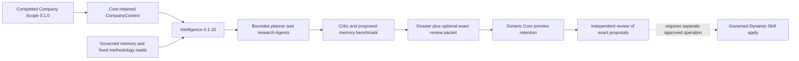

# Pharma prepared review: developer guide

## Objective

Close the evidence gap between a completed company intelligence preview and an
exact, reviewable proposal for Dynamic Skill changes. Preserve existing asset
versions, runtime authority, company isolation, methodology and Agent contracts.

## System context

Scope does not automatically call intelligence. The caller/workflow supplies its
completed run reference to intelligence. Evaluation 0.2.3 is a separate fixture
replay asset; it is not invoked by this graph. A model critic and benchmark do
not imply that independent evaluation occurred.

## Approach and contracts

Use `variables.retain_review_packet=true` and request `retain_preview_result=true`
through the existing execute API. Keep `memory_mode=preview` and
`publish_dossier=false` when reviewing proposals. The new variable is strictly
boolean, defaults false and is never sent to Agents. The output remains the
declared `intelligence_dossier`; only the new version adds this optional field.

The packet uses `pharma_prepared_review.v1`, identifies its asset and fixed Skill
digest, and contains ordered same-company proposals. `packet_sha256` hashes the
UTF-8 canonical JSON of all other fields (sorted keys, compact separators,
ensure_ascii=false, allow_nan=false). Each `replacement_sha256` hashes the exact
UTF-8 `replacement_text`, including its final newline. These section body
digests are distinct from whole-package Dynamic Skill digests and Core artifact
checksums. They identify content and do not grant mutation authority.

Memory proposals retain fact IDs referencing the role-qualified validated claims.
Methodology proposals retain exact deterministic learning text, initialization
state and baseline digest. Planner chunks, requirement catalogue, critic payload,
benchmark questions/results and residual uncertainties remain inspectable.
Research citations retain approved public fields at research-role granularity.
Do not invent per-claim citation assignments: the existing Agent schema does not
provide them. `memory_apply_citations` preserves the existing first-24 projection
used by apply; all role evidence remains available in the packet up to the bound.
Opaque mutation handles, provider envelopes and caller-supplied authority fields
are not exported. Existing generic preview screening rejects credentials,
physical storage paths, signed URLs and runtime control material.

The optional packet and company results must fit 512 KiB before mutations begin.
It fails explicitly rather than silently dropping evidence or candidate bytes.
The runtime retains its independent 1 MiB artifact bound. Five companies and
12 preview / 13 apply Agent calls per company are unchanged. Core owns access,
expiry, storage resolution and retained references.

## Apply safety and remaining capability

For apply, all requested companies' read-only memory and initialized methodology
are checked before the first Agent call. A missing package or invalid memory in
the second company also stops the entire preparation phase without provider
calls or mutations. Initialized snapshots are reused during preparation; CAS
and authority are rechecked by the existing apply path at commit time.

This is prerequisite detection, not a transaction across companies or the two
Dynamic Skills. Concurrent changes, write authority denial, readback failures or
a post-commit benchmark failure can still fail after a successful preparation.
The original execution does not consume a saved packet; any future approved
packet-apply operation must bind the exact original run/artifact/digests, reject
stale baselines, recheck authority, retain per-skill receipts and report partial
commits honestly. Do not regenerate a supposedly approved candidate with Agents.

Company 13 currently has memory but no initialized methodology. Generic atomic
create-if-absent remains a Core/runtime prerequisite for its first methodology
write. An ordinary file upload or invented empty package is not a substitute.
Do not describe preview retention as canonical memory persistence, publication
to a lake/node, or verified S3/GCS upload.

## Validation and promotion

Run the complete deterministic intake suite and pinned 0.1.12–0.1.15 baseline
regressions, packaging imports, immutable manifest checks and promotion-shape
guard. Also run the new packet suite against the installed E SDK with generic
preview validation and JSON serialization. Provider-free tests establish exact
proposal readback, digest sensitivity, role evidence preservation, byte bounds,
no extra calls and early failures with zero Agent/mutable calls.

Create an intake PR against current main, then dispatch Assets'
`adapter-intake-promote-pr.yml` using the exact merged intake SHA and this
adapter's YAML. Validate all previous identities and shared helpers are preserved.
Use the promoted catalog/source with existing E runtime 0.1.105. Do not hand-edit
packaged adapters or upgrade/rebuild the wheel for this compatible adapter change.

A single live company-13 preview verifies transport, actual Agent contracts,
retention/readback, candidate hashes and no canonical writes. Review quality and
write readiness remain separate acceptance boundaries. Preserve old run evidence;
use a new launch intent and job reference, and recover an ambiguous submission by
inspection instead of automatic replay.
