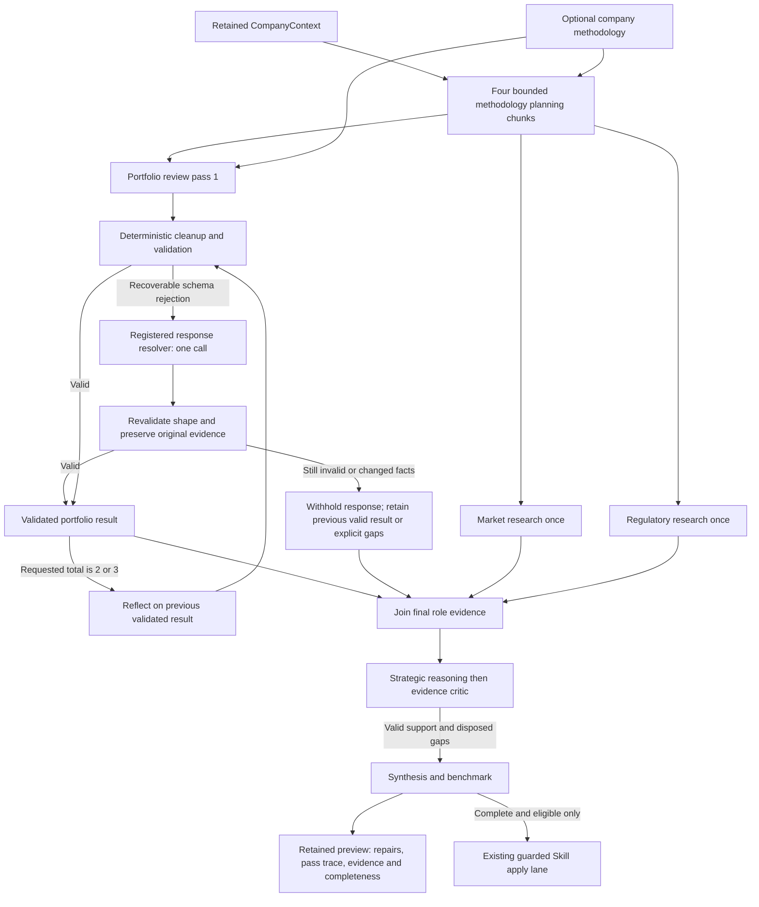

# Pharma research resolution and portfolio reflection — 0.1.17

## Objective

Reduce avoidable whole-run interruptions from malformed research responses,
support companies with different amounts of public information, and add deliberate
portfolio reflection. Keep accepted claims grounded, company scope isolated,
execution finite, and Skill storage/history owned by Core. This is one additive
adapter-intake release, delivered through the existing promotion workflow.

## System context

The company-13 production preview `e30f37b0-9f54-45a0-8205-3d8765cd5ae2`
failed at `portfolio_researcher / research_payload / invalid_schema`. Its portfolio
Agent had admitted citations. The original business response was not retained,
so the exact rejected field remains unknown. Offline fixtures demonstrate the
new handling; they do not reconstruct that hidden response or prove live quality.

Company Scope supplies the retained `CompanyContext`. Intelligence does not query
Companies again. Python calls the existing trusted `inputs.invoke_agent` and
Skill helpers; Assets/Core own provider execution, credentials, storage,
retention, retries, deadlines and publication. The evaluation asset remains 0.2.3.

The published Fixed Skill remains the required, pinned global methodology and
schema/benchmark baseline. **Company-specific learned methodology is optional.**
`dynamic_skill_not_initialized` yields an empty procedural hint in preview; access,
delivery or validation failures are not disguised as absence. Factual memory is
evidence context, not authority to override methodology.

## Approach and model



The three initial research lanes run in parallel. Only portfolio review repeats,
sequentially within its lane. Each pass uses the same company context and role
scope. Reflection consumes the previous validated research object, bounded admitted
citation projection, role plan, fixed evidence rules and relevant optional learned
methodology. It may seek new grounded evidence through the existing two-step
research chain. It is not a search-free rewrite and does not repeat market,
regulatory, planner, strategic, critic or benchmark roles.

The final strategic/critic/synthesis stages run once, after research joins. The
resolver has no search authority and never supplies citation authority. All
citations come from admitted research execution. Role-level citations remain
role-level evidence; this release does not create claim-to-source mappings.

### Total portfolio passes

Add this field to the existing `variables` object:

```json
{"portfolio_review_passes": 2}
```

| Value | Behavior |
|---|---|
| omitted or `1` | Initial portfolio review, using learned methodology when available |
| `2` | Initial review, then reflect on and improve its validated result |
| `3` | Initial review and two successive reflection passes |

These are **total passes**, not additional retries. Only integers 1–3 are accepted;
booleans, strings, zero and larger values reject before Skill/Agent calls. Missing
company methodology does not block any preview pass. Apply retains its existing
initialized-package, quality, CAS, readback and history requirements. A first Skill
package uses the ordinary Core Skill ZIP upload lifecycle shared by fixed and
dynamic Skills; no additional persistence service or Skill publish policy is added.

### Response resolution

1. Validate the typed runtime envelope and expected company/role/schema identity.
2. Deterministically restore section/subsection order only when the complete exact
   ID set is present. Normalize casing/whitespace only for known confidence and
   evidence-kind enums. Reuse retained primitive whitespace normalization. Unknown
   IDs, aliases, booleans and facts are not guessed; text is never truncated.
3. Validate the business payload using a version-owned diagnostic validator that
   preserves the retained validator's ordering, accepted values, defaults and bounds.
   Emit static `role`, `stage`, `field`, `rule` identifiers, never response prose.
4. For a business-schema rejection, invoke declared Agent
   `research_response_resolver` once for that research pass. Pass only declared
   business fields, the static diagnostic and exact typed response contract.
5. Validate its result again and deterministically compare original versus repaired
   evidence. Claim cardinality, statements, section scope, existing factual section
   content by section/subsection identity and uncertainties are preserved. Valid
   evidence/inference metadata cannot change; invalid confidence can only become
   `low`, and invalid evidence kind cannot become a stronger grounded claim. Unknown
   dates can become null. Only explicit boolean strings can become booleans.
6. If repair remains invalid or changes evidence, withhold it. Keep an earlier
   validated portfolio pass when available; otherwise emit canonical evidence-gap
   text with no accepted claims. Stop further reflection in that lane. Other
   research lanes continue. The critic must dispose every claimless role's planned
   requirements as `unresolved_evidence`; missing accounting still rejects.

This is bounded recovery, not a promise that every asset run succeeds. Wrong-company
or wrong-role envelopes, provider/runtime failures, exhausted deadlines, invalid
citations, unsupported claims and quality rejection remain hard boundaries. They
are not converted into apparent success or extra unscheduled repair calls.

### Relaxed constraints for different companies

Research no longer needs to manufacture a positive claim in every specialist lane.
A role can return an empty claim list, explicit uncertainty and canonical evidence-
gap text. Such a role may have no citations because it accepts no positive claims;
the critic must explicitly dispose every corresponding plan obligation. Any role
with positive claims still needs admitted citations. Required sections, real JSON
types, company/role identity, inference labeling, text/list bounds, critic rejection,
unsupported-claim checks and benchmark non-regression remain enforced.

### Finite budgets

One resolver attempt is reserved per possible research pass (portfolio passes plus
two other roles); unused reservations produce no calls. Ordinary call quotas remain
separate, so a repair reservation cannot authorize an extra research/planner call.

| Portfolio passes | Planned calls/company preview / apply | Maximum repair calls/company | Maximum total calls/company preview / apply |
|---|---|---|---|
| 1 | 12 / 13 | 3 | 15 / 16 |
| 2 | 13 / 14 | 4 | 17 / 18 |
| 3 | 14 / 15 | 5 | 19 / 20 |

The five-company ceiling remains: at most 95 logical preview calls or 100 logical
apply calls with three passes and every possible repair. Each research invocation
has two provider steps; the resolver has one. Provider attempts/retries are governed
separately by the runtime. The existing 1,800-second asset deadline, provider timeouts,
runtime input ceilings and optional 512 KiB review-packet/output bound remain.
Three passes are not guaranteed to fit every real execution deadline. Large company
populations belong in the existing generic partition/epoch orchestration, not this
five-company inner adapter loop.

## Changes made and review evidence

Only the new 0.1.17 adapter imports the new version-owned research diagnostics,
cleanup and pass configuration. Shared `agent_contract.py`, `input_contract.py`,
`dossier_contract.py`, `methodology_contract.py` and historical helpers remain
unchanged. Research/critic prompt changes have new contract versions; the repair
Agent has its own declared version and the same shared provider registry entry.

Company results retain repair receipts and `portfolio_review_trace` with pass
numbers, status, before/after result hashes, optional methodology usage and counts.
`research_resolver_agent_call_count` separates repair calls from research calls.
`unresolved_research_responses` contains static diagnostics only.

An unrepaired response sets `research_incomplete=true` and dossier
`business_result_state=incomplete`. Transport completion means a retained preview
is available, not that all research succeeded. Its company's memory mutation is
ineligible and no methodology replacement is produced. An explicit publication
request for such a dossier rejects before any mutation, so partial recovery cannot
silently publish an incomplete business result. Existing apply checks remain in
place for every other eligible company.

## Modularity impact

No Core/Assets runtime business special case, credential, direct HTTP client,
storage backend, new queue, manual wheel build or environment setting is introduced.
The resolver is an ordinary registered Agent role. Fixed and dynamic Skills remain
on the existing shared lifecycle, with their respective binding/mutation contracts.
Promotion preserves existing adapter versions and shared helper bytes.

## Validation and delivery

Offline tests cover diagnostic parity, no raw-value projection, harmless cleanup,
strict evidence-preserving Agent repair, unresolved-response withholding, finite
quotas, one/two/three-pass sequencing, company isolation, optional methodology,
critic gap accounting, review-packet retention and unchanged default business fields.
The full suite also runs pinned historical adapters and the unchanged evaluation
fixtures. These tests use fakes and make zero provider/storage writes.

Use the official Assets **Promote adapter-intake package PR** workflow with the
exact green intake commit and this adapter's `adapter.yaml`; target current Assets
`main`, leave `allow_manifest_removals=false`. The intake manifest intentionally
describes only the current source. The materializer preserves omitted historical
versions/modules and merges them into the aggregate manifest; listing an old
version without its old module can suppress preservation and is incorrect.

Before merging the generated promotion PR, verify every existing identity/module
and shared helper is preserved, the new Agent contract passes package/registration
checks, and CI is green at its current head. Use only the official resulting runtime
artifact when deployment is required. Do not bump/build a wheel locally or replace
the live E worker while another run is active. A future authorized company-13
preview must request retention and inspect both completeness and repair/pass counters
before any claim of live success or eligibility.

## Risks / open questions

The resolver is an additional paid call only on rejection and may itself fail or
propose an unsafe repair; deterministic validation never accepts that proposal.
Reflection can increase cost or reduce quality; more passes are not automatically
better. Benchmark non-regression and independent semantic review remain necessary.
This release does not recover the original failed response, prove full WP1–10
completion, make missing methodology writable without an initialized package,
or solve the separate generic retention crash-consistency gap.
