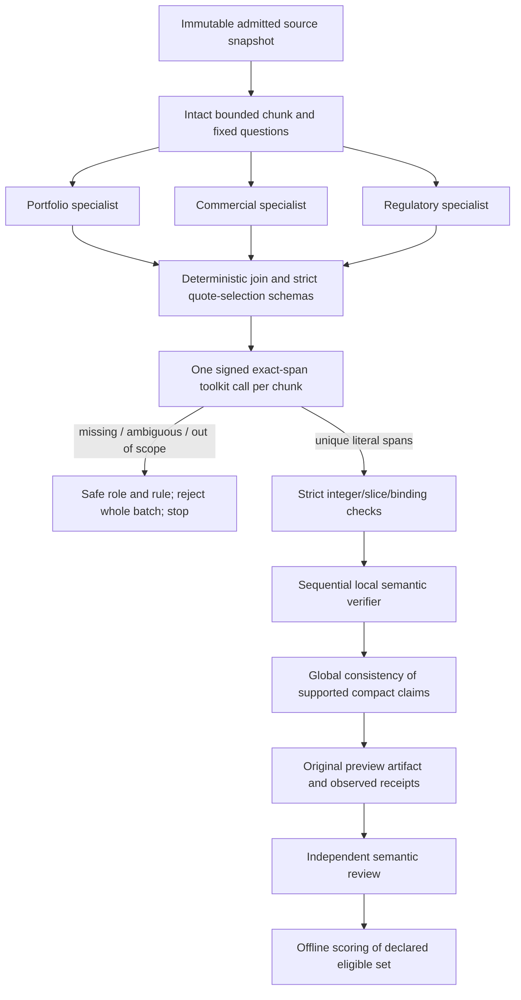

# Generic exact-span repair: source implementation and release gates

Date: 2026-10-07. Tracks [PI-1988](https://linear.app/pipharma/issue/PI-1988), [PI-1974](https://linear.app/pipharma/issue/PI-1974), [PI-1985](https://linear.app/pipharma/issue/PI-1985). This is a source-owned development implementation, not live activation or a measured-quality release.

## Objective

Preserve factual support and critical findings first, then precise source accounting, controlled specialized work, independent measurement and finally efficiency. Remove model character-offset arithmetic from the new candidate without accepting fabricated, repeated, ambiguous or wrong-entity evidence. Reuse a bounded generic utility across domains rather than adding a pharma-specific branch to the runtime.

The first case's original failed response remains unavailable. Run `0455965f-eaf3-4f73-8bc2-9d21a7cdbc92` proved a commercial `evidence_span_invalid` rejection after three completed specialist calls, but did not identify the bad quote/offset pair. The [PR83 report](https://github.com/pipharmaintelligence/adapter-intake/pull/83) records those limits. This repair addresses one avoidable error class and improves future classification; it cannot guarantee recovery of a fabricated or ambiguous quote.

## System context

| Owner | Responsibility |
| --- | --- |
| Shared toolkit 0.1.1 | Deterministic, unique literal quote resolution and closed rejection outcomes |
| Evaluation candidate 0.2.2 | Synthetic source admission, intact context, specialized Agent orchestration, bounded child calls and strict result validation |
| Core / Assets runtime | Authenticated capability plans, registry/binding, provider credentials/execution, transport limits, cancellation, packaging and safe observability |
| Offline evaluation and qualified reviewer | Exact input/result binding, independent semantic decisions, finite-set measurements and release scope |
| Lake / node / storage layer | Canonical data contracts, backend resolution and governance; none is implemented in workflow/tool steps |

Historical toolkit 0.1.0, evaluation 0.1.0–0.2.1, production baseline 0.1.12, its helper/Agent contracts and the original adjudicated suite remain intact. New defaults select explicitly versioned development wrappers; they do not rewrite historical definitions or grant live registration. Existing company/policy demos still invoke 0.1.0.

## Approach

Specialists choose only admitted locators and literal quotes, under a new v2 schema. They cannot supply offsets or tool authority. The trusted parent constructs a content-addressed resolution view and fixed request IDs, invokes the declared child through `RuntimeInputs.invoke_asset`, and verifies version/operation/request/source bindings, output state, ordered cardinality, integer offsets, exact slices and literal uniqueness. It imports no child implementation.

The toolkit validates the whole bounded request batch before searching. Matching stays inside that locator/entity; a second occurrence, including an overlap, rejects. There is no normalization, fuzzy search, first-match selection, truncation, invented quote or partial result. Closed valid-data rejections return an empty span list, static reason and bounded request index. The parent maps that index to its own specialist role and raises the existing classified quality failure. This preserves diagnostic specificity through the callable transport while keeping source/model text outside status/logs. Malformed schema, stale digest, authority and byte/depth limits remain hard contract errors.

Exact source matching establishes provenance, not entailment or textual company attribution. Local semantic verification, independent obligation accounting, global consistency and human adjudication retain their roles. Supported-looking model verdicts do not authenticate independent truth.

## Changes made

- Added toolkit `0.1.1 / resolve_exact_spans`; retained the six historical operation implementations and 0.1.0 identity unchanged. Seven operations remain closed and leaf-only.
- Added evaluation 0.2.2, methodology/plan/result/summary v2. Specialist chain/contracts are 1.1.0 with quote-only instructions; the verifier and provider/model/generation/timeout/budget/no-store policies are unchanged.
- Retained full bounded span receipts for every chunk, including evidence for withheld findings. The scalar summary adds child-call count without source/model text.
- Added explicit `--candidate-version 0.2.2` to the offline projector/evaluator; their defaults remain 0.2.1. Version-specific proposed bindings preserve the five cases and original source/input bytes. Canonical plans and method digests differ intentionally.
- The evaluator verifies complete span receipts, source/request hashes, unique quotes, finding references, child count and scalar agreement. Review receipts bind the selected candidate; batch aggregation rejects mixed candidates or methods as well as mixed suite identity and unadmitted splits.
- Added deterministic adversarial tests, dual-version CI preflight, package discovery/Agent-policy checks and a no-provider signed installed-runtime bridge proof. Updated README and developer guides with the contract and official promotion sequence.

## Modularity impact

Data processing lives in one shared callable toolkit. Source selection/domain questions remain in the parent. Runtime admission, deadlines, retries and cancellation remain generic. No Assets business-source patch, Core code change, provider SDK, new env value, S3/governance branch, mutation/publication path or extra production-adapter capability is introduced.

The specialized graph remains three parallel roles per chunk, then sequential local verification, followed by global consistency after all chunks. Work is finite: four chunks maximum, 6,000 characters per intact chunk, three-specialist concurrency, `4N + 1` logical Agent ceiling (17 maximum), one child per chunk (four maximum), 16 span requests per chunk, 1,800-second deadline, zero repair iterations. Charges occur before calls; the actual signed callable budget is independently enforced. Cache hits do not permit an unbounded parent loop.

The leaf remains limited to 131,072 input bytes, 262,144 result bytes, 32 source units, 24,000 source characters, 600-character nonblank quotes and a 30-second callable timeout. Oversized or invalid data blocks without truncation. Toolkit execution success can carry a rejected data outcome and never implies review completion.

## Validation

Local verification passed **380 deterministic tests**: 258 pharma, 68 evaluation, 41 historical shared-toolkit, 12 exact-span and one intake-shape check. Both declared five-case preflights are ready with zero provider invocations and execution admission still false. The new candidate's per-case child ceilings are 1, 1, 1, 1 and 2; Agent ceilings remain 5, 5, 5, 5 and 9.

The affected deterministic suites cover historical parity, packaged imports/discovery, new contract isolation, literal Unicode/CRLF offsets, missing/repeated/overlapping quotes, wrong entities/inaccessible locators, duplicate/extra fields, source/digest/authority tamper, byte/depth/collection limits, false authority/counters, deadline expiry, pre-call budget enforcement, accepted/withheld receipts and cross-version evaluation/batch rejection. Fake Agents prove protocol behavior, not live factual quality. CI also independently preflights all five cases under both candidate versions and retains text-free manifests for seven days.

The installed runtime 0.1.104 proof uses official intake materialization and a fresh temporary catalog with eleven identities: both toolkit versions, both historical demos, all six evaluation versions and one test-only bridge parent. Signed company/policy requests execute the actual isolated 0.1.1 child. Missing authority, stale digest and changed helper reject; typed `evidence_quote_missing` survives the signed error projection. A real callable session proves cache isolation and rejection of a second uncached call under budget one. The temporary parent is never promoted or registered. No env file or provider is used.

The historical consumer proof separately checks both original demos, their 0.1.0 target, signed responses and negative authority/source/helper/budget paths. These source/materialization proofs do not establish the final CI wheel, live candidate admission, model quality or production source access.

## Risks and next release gates

1. Review/merge this source change. PR83's diagnostic report is an independent documentation PR; neither merging it nor this implementation closes WP1.
2. Officially promote toolkit 0.1.1 and evaluation 0.2.2 from the same exact reviewed commit. Review/merge generated Assets changes; require packaged import/discovery, manifest/catalog and complete wheel validation. Do not manually bump the runtime or install a wheel from unmerged edits.
3. Verify the delivered complete wheel, import origins, all identities and module/helper hashes; replace only the owned idle E: worker. Existing runtime 0.1.104 supports the offline bridge but does not yet package these new identities.
4. Establish exact server registration/bindings, admitted specialist 1.1.0/verifier 1.0.0 definitions and the parent/child signed plan. No live admission was created by these tests. Preserve existing E: env selection; no server-env copy or new values are required by this source fix.
5. Complete the needed domain scope/contract review, then authorize one bounded new-candidate diagnostic case. Stop at its outcome; retain original bytes and observed same-run usage. A rejected run does not produce a completed preview; never synthesize a reviewer receipt from status summaries.
6. Independent review and offline scoring precede candidate quality claims. Complete the explicitly declared set, preserve blocked/unrun cases and unknown counters, and separately resolve baseline eligibility/comparability, held-out admission, calibrated thresholds and readiness amendment before dependent WPs advance.

Current quality evidence remains **0 evaluated / 5 declared development cases**: the original 0.2.1 first case is blocked, four are unrun, and 0.2.2 has no live provider execution. WP1 remains incomplete; WP2–WP10 retain their existing gates. Real-document extraction, source-node/lake binding, OCR/table quality and held-out evaluation remain separate contracts. Missing/fabricated/ambiguous evidence deliberately remains a blocker.
