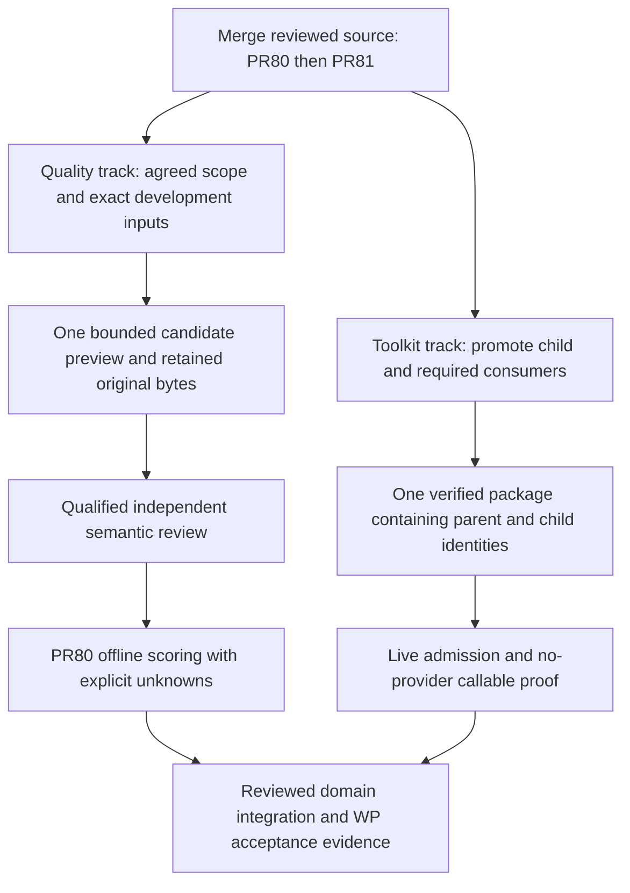

# PR80 / PR81 readiness and delivery sequence

Reviewed 6 October 2026, Asia/Amman. This records a source review and an ordered delivery proposal. It does not merge, deploy, admit a capability, amend a WP gate, or report measured semantic quality.

## Decision

Merge [PR80](https://github.com/pipharmaintelligence/adapter-intake/pull/80) first, then [PR81](https://github.com/pipharmaintelligence/adapter-intake/pull/81), after the current-head checks pass. The changes are independent and merge without conflicts. This order makes the evaluation infrastructure available before the reusable capability is promoted. Each is ready within its declared development scope; neither completes WP1-WP10.

| PR | Reviewed executable revision | Purpose | Runtime consequence |
| --- | --- | --- | --- |
| 80 | `13efc3b9880434c522276525baddf6da9357f232` | Offline quality evaluation of retained pharma evaluation `0.2.1` previews, exact source/result bindings, independent reviewer receipt and finite batch accounting | Pulling the evaluator source is sufficient; this PR needs no wheel, worker restart or new environment values |
| 81 | `4c77e403f42ddc7a167c66ce30694126415b13f2` | Generic deterministic toolkit and two synthetic consumers over the existing callable bridge | New identities require official promotion, packaging, installed catalog verification and separate live admission |

The coordination document and companion-guide clarification are documentation follow-ups to the PR81 executable revision above. CI should always be checked against the final PR head.

## Combined validation

An isolated checkout combined the exact two executable revisions against intake main `a68db69adbec071d43ba3cddf3358608fbf3c15d`. No source merge conflict occurred.

- 227 pharma tests passed, including PR80's 39 candidate-evaluator tests.
- 49 evaluation packaging/parity/source-review tests passed.
- 41 toolkit/consumer tests passed.
- The repository-wide promotion-shape guard passed.
- Total relevant deterministic checks: **318 passed**.
- The installed runtime `0.1.103` executed both consumers through signed requests and real isolated callable subprocesses. Both resolved the same toolkit entry hash.
- Missing callable authority, changed source digests, wrong consumer domains, unavailable roles and modified reviewed helpers were rejected with signed failure responses.
- A real runtime session proved cache-copy isolation and rejection of a second uncached call under `max_child_calls=1`.
- The full official Assets materializer separately accepted all three intake folders from the pinned PR81 revision; generated catalog discovery contained exactly three identities.

The installed-runtime proof constructs a local signed plan; `live_admission_proven=false` and `semantic_quality_measured=false` remain explicit. Its one-call plan does not establish that a live Core run is configured with the same limit.

### Separate repository failure

A broader `tests/test_*.py` run found three failures in the nine-test SFDA preparation suite. The same three failures were reproduced on unchanged intake main:

1. Missing `sfda_getdrugs_daily_changes.authoring.json`.
2. Missing `run_profiles/sfda_getdrugs_daily_changes.dlm.json`.
3. A YAML string assertion assumes `daily_changes_self_inspection.py` is the first reviewed helper, while the contract also lists `__init__.py`.

Neither PR changes those files. Their green targeted CI must not be described as a green result for every repository test. Repair that SFDA source/test drift separately; do not mix it into these review-system PRs.

## Contract boundaries

PR80 accepts `adapter_preview_result.v1` retained artifacts for `nusaibah.pharma_company_intelligence_lab_evaluation:0.2.1`, containing `evaluation_result` and `evaluation_summary`. It admits adjudicated development cases and rejects held-out access until a reviewed development-freeze/admission contract exists.

PR81 emits `review_tool_result.v1` / structural previews. Its company and policy demos use supplied synthetic verdict assertions, zero Agent calls, zero mutable calls and no publication. They are reusable-execution evidence. They are not PR80 quality-evaluation inputs. Scoring a future toolkit-assisted domain asset requires an explicit domain result/evaluation contract and independent semantic review.

Source/methodology/input digests identify exact data; they do not authenticate a semantic reviewer. A successful worker response, structural completeness, a quoted source span, or a model critic does not establish independent factual quality.

The historical `0.1.12` baseline, the `0.2.1` supplied-source candidate and the toolkit demos remain separate evidence tracks. Preserve their original input/result bytes and identities.



## Ordered next work

### 1. Resolve the WP1 scope/comparability decision

This remains the highest-priority acceptance blocker. The frozen `0.1.12` asset cannot execute the thirteen document cases, while the current readiness gate requires every suite case to be measured. The supplied-source candidate explicitly reports `baseline_comparable=false`. Repeated successful smokes cannot resolve that mismatch.

Prepare a versioned decision for domain-owner review defining eligible cases, denominator/failure rules, mode-compatible thresholds and the exact evidence that can unlock WP2. Preserve all 24 adjudicated cases. Record legacy unsupported cases as unmeasured; a separately named supplied-source benchmark must not retroactively become an unchanged legacy measurement.

Existing Linear evidence checked for this review: [PI-1972](https://linear.app/pipharma/issue/PI-1972) and [WP1 / PI-1974](https://linear.app/pipharma/issue/PI-1974) remain In Progress; WP2-WP10 remain Backlog. This document does not change those states or grant domain approval.

### 2. Prepare exact development inputs without provider execution

The next implementation slice is a deterministic truth-free input projector/preflight for PR80's exact adjudicated development fixtures. Start with `company-small-identity-001`; then classify the already proposed finite set:

- `company-wrong-entity-005`
- `company-source-injection-006`
- `company-missing-evidence-007`
- `company-conflicting-dates-003`

Read only source identity/content, scope and required input metadata. Keep expected findings, reviewer decisions, criticality labels, acceptable-abstention answers and thresholds outside provider input. Preserve source text/locator sets and wrong-entity/accessibility distinctions. Use PR80's validator to classify each projection; do not force a case into the executable set.

After the agreed eligibility decision and local preflight, run at most one admitted bounded preview to prove the measurement process. Retain its original inputs, run identity, full result and observed receipts. Obtain an independently completed review receipt and score offline. Report missing usage as unknown. The old `synthetic-source-review-001` retention smoke remains operational evidence; do not rename or rescore it as an adjudicated suite fixture.

A scored development case proves the process only. Actual agreed-set measurements and the reviewed WP1 decision are still required before dependent product work is unblocked.

### 3. Promote the reusable toolkit in the development lane

After both source PRs merge, pin the resulting intake main commit. Prepare the toolkit and required consumer packages using the official Assets materializer. The three source contracts are:

```text
adapters/nusaibah/structured_review_toolkit/adapter.yaml
adapters/nusaibah/company_review_tools_demo/adapter.yaml
adapters/nusaibah/policy_review_tools_demo/adapter.yaml
```

The current `adapter-intake-promote-pr.yml` workflow takes one `intake_adapter_yaml` per dispatch. It does not automatically promote a parent's callable dependencies. For that workflow, promote/merge the toolkit first, then the required consumers against the updated Assets base. Alternatively, prepare one combined Assets PR by invoking the official materializer for all three contracts before publishing manifest/catalog generations. Do not hand-copy or edit generated package files.

Perform package/import/boundary validation before an installed-wheel change. Build/install the verified final package once it contains the required parent/child identities; do not install an incomplete package after each individual source promotion. Version >=0.1.103 establishes the declared runtime minimum, not proof that a wheel includes these new adapters.

Check installed catalog resolution and module/helper hashes for:

```text
nusaibah.structured_review_toolkit:0.1.0
nusaibah.company_review_tools_demo:0.1.0
nusaibah.policy_review_tools_demo:0.1.0
```

Use existing registration/binding and signed callable admission. Inspect the actual live plan budget rather than inventing a CLI flag or environment override; the reviewed builder defaults to eight uncached calls and supports 1-256. Each demo executes one child and contains no parent loop. Run one no-provider positive proof per consumer and bounded negative cases. Inspect signed receipts, installed hashes and the preserved structural-only flags. Stop at the first invalid boundary rather than repeatedly restarting a provider smoke.

No new environment values are required by either PR. Keep lake/storage/governance resolution in existing services, credentials/admission in Core and execution controls in the runtime. Agent/MCP exposure, authenticated semantic integration, large-document extraction, ECS and apply/publication remain separately reviewed work.

### 4. Integrate domain specialists after accepted contracts and measurements

Once the relevant scope/WP gates are accepted, let domain assets declare methodology, specialist roles, schemas and finite plans while invoking the shared toolkit for deterministic preparation/checks. Measure critical recall, precision, factual support and truthful incomplete states before optimizing token usage. A new domain should not add identity-specific dispatch to the runtime or copy the shared helpers.

Keep held-out truth sealed until the reviewed candidate freeze/admission contract exists. Do not treat generic reuse or the two synthetic demonstrations as a held-out quality pass.

## Operator verification immediately after source merges

From the existing intake checkout, after confirming it has no tracked local edits:

```powershell
$IntakeRoot = "E:\nusaibah_projects\demo_asset_project\adapter-intake-work"
$Python = "E:\nusaibah_projects\demo_asset_project\.venv\Scripts\python.exe"
Set-Location -LiteralPath $IntakeRoot
$TrackedChanges = git status --porcelain --untracked-files=no
if ($LASTEXITCODE -ne 0) { throw "Stop: unable to inspect this Git checkout." }
if ($TrackedChanges) { throw "Stop: preserve and resolve tracked local edits before switching branches." }
git fetch origin
if ($LASTEXITCODE -ne 0) { throw "Stop: Git fetch failed." }
git switch main
if ($LASTEXITCODE -ne 0) { throw "Stop: Git branch switch failed." }
git pull --ff-only origin main
if ($LASTEXITCODE -ne 0) { throw "Stop: resolve the Git error before continuing." }
& $Python -m unittest discover -s adapters/nusaibah/pharma_company_intelligence_lab/tests -p "test_*.py" -q
if ($LASTEXITCODE -ne 0) { throw "Stop: pharma/evaluation tooling tests failed." }
& $Python -m unittest discover -s adapters/nusaibah/pharma_company_intelligence_lab_evaluation/tests -p "test_*.py" -q
if ($LASTEXITCODE -ne 0) { throw "Stop: evaluation packaging/source-review tests failed." }
& $Python -m unittest discover -s tests -p "test_structured_review_toolkit.py" -q
if ($LASTEXITCODE -ne 0) { throw "Stop: toolkit contract tests failed." }
& $Python -m unittest discover -s tests -p "test_adapter_intake_contract.py" -q
if ($LASTEXITCODE -ne 0) { throw "Stop: intake shape validation failed." }
& $Python tests\prove_review_toolkit_worker.py --report "$env:TEMP\review-toolkit-worker-proof.json"
if ($LASTEXITCODE -ne 0) { throw "Stop: offline installed-runtime proof failed." }
```

These commands are offline source/integration checks using the existing E: development Python. They load no env file and make no provider call. They do not install a wheel, restart a server, register an asset or prove live admission.

## Exit record

Source merge readiness is established for the two reviewed executable revisions. Final documentation-head CI, approved WP1 scope/measurement evidence and official toolkit promotion/live admission are separate gates. No merge, paid execution, deployment, runtime/env edit, tracker-state change or approval of a new baseline was performed by this review.
