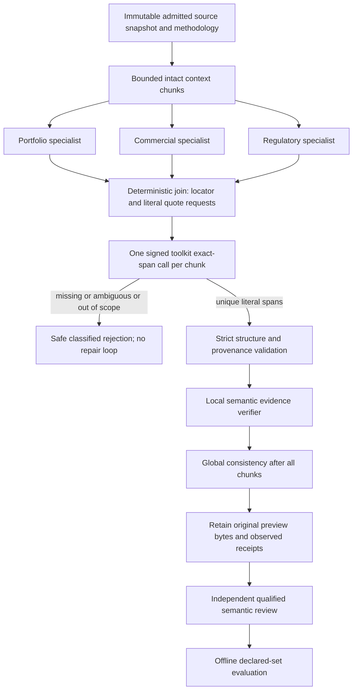

# WP1 first development run: delivery verified, evidence-span gate blocked

Date: 2026-10-07, Asia/Amman. Tracks: [PI-1988](https://linear.app/pipharma/issue/PI-1988), [PI-1974 / WP1](https://linear.app/pipharma/issue/PI-1974), [PI-1985 / baseline measurement](https://linear.app/pipharma/issue/PI-1985).

**Outcome:** the merged package was delivered and the E: worker remained healthy. Exactly one development preview failed at `source_commercial_reviewer / source_review_findings / evidence_span_invalid`. No preview result was produced, no quality measurement is available, and no further provider execution was attempted. WP1 remains incomplete; WP2–WP10 retain their existing gates.

This report separates verified facts from a proposed repair. The proposed toolkit operation, candidate contract and diagnostic subreasons below are **not implemented or promoted** by this documentation change. The operator instruction authorized one diagnostic execution; it does not supply independent domain approval of the proposed five-case scope, thresholds, source bindings or a replacement baseline.

## Objectives, in priority order

1. Preserve factual support and critical findings. Reject unsupported claims, wrong-company evidence and false-complete reviews.
2. Produce precise findings with literal evidence and independent semantic review. A source substring alone does not establish entailment.
3. Control work with immutable source identity, intact related context, specialized roles, finite calls and deadlines, and zero repair loops.
4. Retain inspectable evidence and measure the complete declared eligible set without concealing blocked cases.
5. Optimize tokens, latency and cost only after comparable quality evidence exists. Do not weaken validation to save calls.

## Verified delivery and activation

| Boundary | Evidence | Result |
| --- | --- | --- |
| Adapter source | [Intake PR82](https://github.com/pipharmaintelligence/adapter-intake/pull/82), merged `83768928d5bfd31687b8d6c4fe5aee3b03d0adb7` | Merged; E: intake main fast-forwarded |
| Official runtime promotion | [Assets PR486](https://github.com/piusaibah/assets/pull/486), merged `4558e210e10815e0fb82edd276905173731b4dd8` | Merged; Assets main fast-forwarded |
| Merged intake CI | [Run 37536297409](https://github.com/pipharmaintelligence/adapter-intake/actions/runs/37536297409) | Passed at the merged source commit |
| Merged runtime CI | [Run 37536311968](https://github.com/piusaibah/assets/actions/runs/37536311968) | Package-boundary and Windows diagnostic jobs passed at the merged commit |
| Installed package | Complete `pi_obs_python_runtime-0.1.104-py3-none-any.whl`, SHA256 `11b8915905dfe3447b33b83d1ac9d3aece922f0cd7926d801530c0469173b105` | Version 0.1.104; 410 package files match this wheel exactly |
| Catalog | Generation `a316495c37a91b91944343c8e25f8dd2a5a6a916fff1602cd60f7d793c63dc50` | Toolkit, both demo consumers and evaluation 0.2.1 resolve |
| Isolated package proof | Signed company and policy parent/child calls from a complete installed verification target | Passed; one child call per demo, zero Agent/mutable calls; missing authority and changed source digest rejected |
| Active worker | E: `.venv`, port 8785, `runtime_egress`, maximum concurrent executions 2 | Restarted; health ready before and after the preview |
| Evaluation Agent admission | All four existing 0.2.1 role contracts, idempotent apply | `no_change`; no chains or registry entries created |

The complete wheel came from `python_runtime/dist`, not `dist/ecs-base`. Business changes came through adapter-intake and official promotion. There was no source-only business patch inside Assets, no env-file edit, and no lake, S3 or governance configuration change.

The worker/client env-file was `E:\nusaibah_projects\demo_asset_project\.env`. The generic worker helper parameter is named `AssetsEnvFile`, but its actual argument was this E: file. A separate read-only checkpoint diagnostic used the already configured local PHP application; that does not change the worker's env selection.

The toolkit demonstration proof used locally signed test authority. It establishes installed runtime support, not live server registration/binding or semantic quality of either demo. Their live admission remains a separate gate.

### Installation safeguards and rollback evidence

The initial deep verification directory exceeded Windows path limits during pip's temporary-directory copy. It was a partial installation even though an earlier pip message said “Successfully installed”. Any proof from that partial target is invalid as package-delivery evidence. It was preserved as `verification-installed.partial-path-failure`, and its report as `package-worker-proof.partial-install.invalid.json`.

The replacement verification installation used the short target `E:\nusaibah_projects\demo_asset_project\.verify104` with `--no-compile`. All relevant imports were checked to originate in that complete target before the signed proof. Its valid receipt is `package-worker-proof-complete-install.json`.

Before activation, the old distribution's 439 non-bytecode files were preserved in `runtime-0.1.103-before-upgrade.zip`. A complete rollback wheel was also downloaded from successful main [run 37377894663](https://github.com/piusaibah/assets/actions/runs/37377894663), commit `d69018645da9c30b4c67343a9a957610ee28a3b8`. Its catalog matches the original install; the 70 differing package files differ only in LF/CRLF encoding. It is not a byte-identical substitute for the original file backup.

Two stale pip metadata directories for older 0.1.91/0.1.97 installs were moved reversibly into the release's `old-pip-metadata` directory after checking their distribution identity. They caused invalid-distribution warnings and misleading pip log text. Actual import metadata, file hashes and catalog resolution establish the active version; a pip success line alone does not.

Only the verified worker process tree was stopped. The old module-command-only stop helper does not recognize a console-executable launch; a broad “kill all Python” action is inappropriate. Future stop helpers should recognize the exact console launcher, E: env path, ancestry and listening port. This report does not modify that helper. Rollback, if needed, must also stop the owned idle worker before package replacement and repeat metadata/hash/catalog/health checks before any execution.

## Exact case and run

Five truth-free inputs were exported from the merged projector into:

`E:\nusaibah_projects\demo_asset_project\runtime-artifacts\wp1-development-inputs-merged-2026-10-07`

The manifest retains actual suite/binding/input hashes and the declared set. Only `company-small-identity-001.inputs.json` was executed. Its SHA256 is `f15fefaa313b9ace36d8c13edcc7faeed51144f4791c9c75ed3408b1247501ff`; size 646 bytes. Adjudicated answers, criticality, reviewer notes and thresholds were excluded from Agent input. One target source contained 74 ASCII characters; the distinct-company distractor was excluded before Agent execution. The source plan had one target chunk and a five-logical-call ceiling.

| Field | Observed value |
| --- | --- |
| Run UUID | `0455965f-eaf3-4f73-8bc2-9d21a7cdbc92` |
| Candidate | `nusaibah.pharma_company_intelligence_lab_evaluation:0.2.1` |
| Candidate module hash | `d04e4f1ed55a1630859efa2d974f432c40bde5593c05d3ccacc0e37dc651f538` |
| Start / end | `2026-10-07T01:03:42+03:00` / `2026-10-07T01:03:56+03:00` |
| Terminal status | Failed; client poll did not time out |
| Failure code | `pharma_evaluation_quality_rejected` |
| Proof | `agent_contract`, role `source_commercial_reviewer`, stage `source_review_findings`, rule `evidence_span_invalid` |
| Completed logical Agent calls / provider turns / receipts | 3 / 3 / 3 |
| Reported tool calls / retries | 0 / 0 |
| Provider-reported input / output / thought tokens | 3,294 / 714 / 2,245 |
| Provider-reported total tokens | 6,253 |
| Monetary cost | Not reported; unknown |

The server timestamps span approximately 14 seconds. The poll receipt's `duration_seconds=3.237` measures that client's polling interval, not full run duration. Usage belongs to this run and is provider reported; these counters do not measure business quality or establish a cost improvement.

The three specialists ran concurrently within the admitted chunk. Their results are joined in deterministic role order and structurally validated before the local evidence verifier. That explains the three completed calls despite the commercial rejection. Local semantic verification, global consistency and preview assembly were not reached. There was no adapter repair/retry loop. Absence of provider web citations is expected in this supplied-source lane; this failure is not `research_citations_missing`.

## What the span failure proves

Primary source: [`_validate_specialist` in supplied_source_review.py](../../adapters/nusaibah/pharma_company_intelligence_lab_evaluation/supplied_source_review.py). Locator validity is checked separately. After that check, the grouped `evidence_span_invalid` gate requires all of:

```python
type(start) is int
type(end) is int
0 <= start < end <= len(text)
_text(quote, 600)  # nonblank string, at most 600 characters
text[start:end] == quote
```

The gate proves that the commercial response violated at least one of those requirements. It does **not** identify which requirement failed. Available sanitized status, trace and result projections do not expose the offending quote/start/end pair. A read-only search of the existing two local workflow checkpoints found zero retained provider-operation responses suitable for structural inspection; it made no provider calls and printed no source/model text.

Therefore off-by-one indices, string/bool offsets, quotation differences and a fabricated quote remain possible explanations, not established causes. This case's admitted target source is ASCII, so Unicode indexing is not an evidenced explanation for this run. No other authorized transient reference has been shown to contain the lost response. Repeating a paid run cannot recover the original response.

The strict gate is appropriate: a commercial statement must not acquire invented evidence. The current contract makes the model supply both literal evidence and exact character arithmetic, and groups several failure causes into one safe code. That is a reliability and diagnosability weakness worth addressing without treating the missing subcause as known.

## Retention and measurement boundary

Result inspection returned no output roles and no outputs, with no full-output reference or reported preview retention. Downloading a preview returned `preview_result_read_or_integrity_check_failed`; no preview bytes exist locally for this failed run. The adapter rejected specialist output before assembling its business result. This is not evidence of an S3 retention defect, and changing lifecycle settings cannot manufacture an unproduced result.

The saved launch, poll, trace and structural diagnostic are operational evidence, not a retained 0.2.1 evaluation result. Do not create an independent review receipt or candidate quality score from these summaries. Preserve the input and failure receipts without editing IDs or source bytes to make an old successful smoke fit this fixture.

| Declared case | Measurement state | Prepared logical-call ceiling |
| --- | --- | --- |
| `company-small-identity-001` | Blocked at span validation; not evaluated | 5 |
| `company-wrong-entity-005` | Unrun, unmeasured | 5 |
| `company-source-injection-006` | Unrun, unmeasured | 5 |
| `company-missing-evidence-007` | Unrun, unmeasured | 5 |
| `company-conflicting-dates-003` | Unrun, unmeasured | 9 |

The declared pilot has **0 evaluated cases out of 5**, not zero faithfulness/precision/recall and not zero cost. The original 24-case adjudicated suite, unchanged 0.1.12 baseline, held-out sealing, thresholds and comparability rules remain untouched. See the [WP1 scope/comparability proposal](WP1-Scope-and-Comparability-Decision.v1.md). Candidate completion, even after repair, cannot silently replace the original readiness contract or unlock dependent WPs.

## Proposed generic repair

Keep 0.2.1 and the baseline immutable. Use the canonical structured-review toolkit for reusable deterministic evidence processing; keep domain roles, source selection and semantic judgment in the source-owned review adapter. Do not add a pharma-specific branch to the generic isolated runner.

Proposed new contracts, with versions to be reviewed rather than presumed available:

1. A new toolkit version adds one closed operation, provisionally `resolve_exact_spans`. It receives an immutable admitted source snapshot and bounded locator/literal-quote requests, binds source/entity/digests, and computes exact Python Unicode-codepoint offsets deterministically. This is a cohesive seventh operation alongside the existing six, not an arbitrary-function interface.
2. A new candidate and specialist contract asks models for admitted locator plus literal quote. Trusted orchestration invokes the toolkit through a declared `RuntimeInputs.invoke_asset` role to produce canonical spans. The existing strict evidence validator then checks the canonical result, before semantic verification. This is an explicit contract change, not silent correction of a malformed legacy 0.2.1 response.
3. Split safe failure codes into type, range, quote-type/size and exact-slice mismatch where applicable. Emit only bounded classifications/counts, role, stage and contract identity. Never enable unrestricted raw prompt/model-response logging to diagnose a citation failure.

Quote matching must be literal and unique within the explicitly admitted locator. Missing, inaccessible, wrong-entity, unknown-locator, stale-snapshot and ambiguous evidence must reject. Count overlapping occurrences as ambiguity. Do not trim, normalize Unicode/line endings, perform fuzzy matching, select the first repeated occurrence or search other entities. Exact provenance still requires local semantic verification and independent human review for quality.

This direction removes model offset arithmetic as one source of failure. Because the original bad pair is unavailable, it cannot guarantee recovery if the actual problem was a fabricated or ambiguous quote. Such evidence should continue to block.



### Finite work and separation of controls

Retain the source candidate's at-most-four chunks, three-specialist concurrency, `4N + 1` logical Agent ceiling (maximum 17), 1,800-second deadline and zero repair iterations. Separate data operations, selection and execution controls. The deterministic leaf introduces no Agent, network, storage, publication, retry, scheduler or nested dependency.

Batch all span requests once per chunk: at most 16 requests from four obligations × two findings × two evidence spans. At most four child invocations cover four chunks. Declare the exact child identity/result contract and obey the actual server-signed callable call budget; do not invent a CLI/env override or confuse a leaf operation count with an Agent count. Runtime default/cap ranges are configuration capabilities, not permission to raise this candidate's budget. A cached child result does not bound a parent loop.

Retain the toolkit's input/result byte ceilings (131,072 / 262,144), source text limits, finite result sizes and subprocess timeout. The new operation must also validate request count, quote size, duplicate/extra fields and output cardinality before work. Resolve each quote with a bounded exact search and stop once ambiguity is established. Oversized inputs block without truncation. A candidate operation should return only required bound evidence to the orchestrator, not another full context packet to a semantic model.

Backend resolution stays in lake/storage adapters. Source nodes remain data contracts; workflow steps and this deterministic tool do not acquire S3/catalog/governance logic. Observability stores safe projections and authorized artifact references, not canonical source data or secrets in a database summary.

## Implementation and release gates

1. Review the new quote-selection schema, source/authority binding, finite limits and version identities in adapter-intake. Keep old identities/module hashes resolvable and historical fixtures unchanged. Update toolkit README and developer guide with the new operation, structural-only evidence boundary and consumer pattern.
2. Add meaningful deterministic tests: unique/repeated/overlapping quotes; unknown/wrong-entity/inaccessible locators; stale hashes; quote/field/type/byte/count limits; Unicode and CRLF exact offsets; tampered child authority/budgets; and rejection of invalid spans under the old 0.2.1 contract. Add candidate orchestration tests with fake Agent/tool delegates proving call order, one child per chunk, failure before verifier and no retry.
3. Validate all identities with package-relative imports and discovery scans. Prove the complete installed wheel's signed parent/child path; do not rely on source-checkout `sys.path` workarounds or an ECS-base wheel.
4. Promote the exact reviewed source commit through the official promotion workflow. A runtime version changes only through that reviewed materialization/build path; do not manually bump a wheel as a business fix. Repeat complete artifact/hash/origin/catalog checks before replacing an idle owned worker. Record existing E: env, actual model/admission and methodology identities.
5. Obtain the necessary domain scope/contract review and exact new runtime admission. Then authorize **one** bounded new-candidate diagnostic preview; preserve it as a new run and stop at its outcome. It is not a retry of this lost response or evidence for an unchanged 0.2.1 benchmark.
6. Only a retained full result permits a bound independent review receipt and offline scoring. Complete the explicitly declared development set before any candidate quality conclusion; separately resolve baseline eligibility, held-out admission, thresholds/comparability and readiness amendment before WP2–WP10 advance.

Safe subreason diagnostics can be implemented independently, but still require a versioned contract and review. They should not be used to justify another run before the evidence-contract issue is addressed. Real-document extraction and lake binding are separate contracts; five small synthetic company inputs do not establish OCR/table/document quality.

## Local evidence locations and read-only verification

Release receipts and logs:

`E:\nusaibah_projects\demo_asset_project\runtime-artifacts\toolkit-promotion-0.1.104-merged-4558e210`

Valid delivery receipts: `package-worker-proof-complete-install.json`, `operational-package-verification.json`, `worker-start.json`. Original runtime backup and superseded partial-install files stay separate in that directory.

Case receipts in the five-case export directory: `projection-manifest.json`, `company-small-identity-001.inputs.json`, `.launch.json`, `.poll.json`, `.trace.json`, `.span-diagnostic.json`. No `preview-0455965f-eaf3-4f73-8bc2-9d21a7cdbc92.json` was created. These local diagnostic receipts are not uploaded in this docs PR.

The following does not launch a provider or load any env file:

```powershell
$ProjectRoot = 'E:\nusaibah_projects\demo_asset_project'
$Python = "$ProjectRoot\.venv\Scripts\python.exe"
& $Python -c "import importlib.metadata as m; print(m.version('pi-obs-python-runtime'))"
if ($LASTEXITCODE -ne 0) { throw 'Runtime metadata check failed.' }
Invoke-RestMethod -Uri 'http://127.0.0.1:8785/health' -TimeoutSec 5

$BatchRoot = "$ProjectRoot\runtime-artifacts\wp1-development-inputs-merged-2026-10-07"
$Poll = Get-Content -LiteralPath "$BatchRoot\company-small-identity-001.poll.json" -Raw | ConvertFrom-Json
$Poll.status_response.data | Select-Object status, failure_code, proof_stage, proof_failure_detail, agent_execution_evidence
```

Expected: runtime 0.1.104, worker ready, and the same terminal span failure with three completed calls. Health alone does not prove package integrity or candidate quality; use the preserved delivery receipts for those distinct boundaries. Do not use runtime contract-check/preflight commands as a substitute for read-only health checks when those commands can launch an asset.
