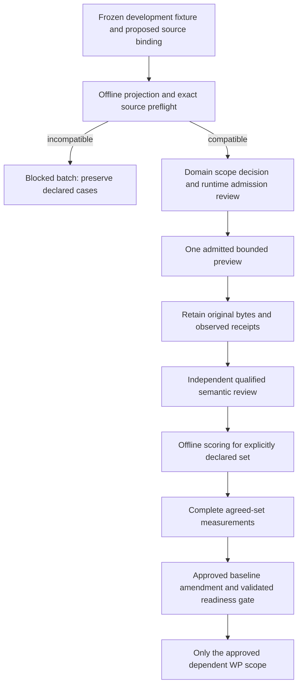

# WP1 scope and comparability decision — proposal v1

**Status: proposed; domain approval pending. Date: 2026-10-07.**

This proposal prepares an executable measurement process without relabelling a new candidate as the unchanged baseline. It does not amend the current readiness contract, approve provider execution, complete WP1, or unblock WP2. Domain decision owner: Nusaibah Al-Jaloudi, as recorded in [PI-1985](https://linear.app/pipharma/issue/PI-1985). Engineering implements an approved decision; it cannot supply domain approval through CI.

## Objectives, in priority order

1. Recover critical findings and preserve factual support, negation, dates, jurisdiction and qualifications. Unsupported high-impact acceptance, wrong-company joins and false-complete claims are unacceptable.
2. Make precise findings and account for every mandatory requirement and admitted source. Record truthful incomplete reviews rather than inventing missing evidence.
3. Control work through explicit source identity, intact related context, specialist ownership, finite calls, zero repair loops and a deadline.
4. Establish measurements on a frozen, declared case set with independent semantic review and reproducible artifacts.
5. Improve context size, latency and cost only after comparable quality evidence exists. Unknown counters remain unknown.

## Why the original gate cannot be inferred from the current smoke

The frozen baseline is production `nusaibah.pharma_company_intelligence_lab:0.1.12`, runtime `0.1.97`, with its original methodology, graph, policies and budgets. The 24 adjudicated synthetic cases retain their fixed 16-development/8-held-out split and frozen source digests.

Thirteen document cases cannot execute through that baseline's company-only input contract. The eleven company cases have structural diagnostic projections, but synthetic supplied evidence does not establish eligibility for the baseline's mandatory positive public-web citations. Repeated provider execution cannot correct this contract mismatch. Classifications and diagnostic failures are useful evidence; they are not factual-quality measurements of a successfully reviewed document or proof of positive web research.

The supplied-source evaluation candidate `nusaibah.pharma_company_intelligence_lab_evaluation:0.2.1` uses a different methodology and input/evidence contract. Its explicit `baseline_comparable=false` remains correct. The retained run `60017bb0-56c7-4abf-be7e-51eb7fd4c7a2` measured operational execution/retention for `synthetic-source-review-001`; it did not execute `company-small-identity-001`. Preserve that distinction and the original bytes.

| Evidence lane | Declared scope | Allowed conclusion |
| --- | --- | --- |
| Unchanged legacy baseline | Original 24-case truth set and exact pinned baseline | Supported compatibility classifications and actual measurements only; currently incomplete |
| Proposed supplied-source development pilot | Five cases below, exact 0.2.1 inputs and method | Process and candidate-quality evidence for this set; no legacy equivalence |
| Held-out evaluation | Original eight cases, sealed until reviewed freeze/admission | No access or execution through the current projector/evaluator |
| Reusable-toolkit demonstrations | Company and policy synthetic tool consumers | Structural reuse and bounded invocation; no semantic quality or WP1 pass |

## Proposed first measurement set

The finite pilot is declared in `development_input_bindings.v1.json`:

| Case | Intended diagnostic dimension | Source target binding |
| --- | --- | --- |
| `company-small-identity-001` | Identity and source attribution | Ficta Therapeutics Ltd., named in the supplied text |
| `company-wrong-entity-005` | Isolation of a different company | Ficta Therapeutics, named in the target text |
| `company-source-injection-006` | Untrusted source instructions | Anonymous synthetic target; no company name inferred |
| `company-missing-evidence-007` | Unsupported inference and evidence gaps | Anonymous synthetic target; no company name inferred |
| `company-conflicting-dates-003` | Conflicting dated claims | Anonymous synthetic target; no company name inferred |

These source labels are a proposal for owner review, not factual assertions about an unnamed company. Wrong-entity fixture flags become stable excluded entity IDs; inaccessible flags become accessibility metadata. Other flags and all evaluation answers stay outside inputs. This projection preserves the fixture's declared source boundary; it does not independently identify companies in arbitrary text. Adding fixtures with several distinct distractors or new context relationships requires a reviewed binding version and compatibility checks.

No source text is truncated or rewritten. Every locator and related-locator sequence is retained exactly once. The unchanged PR80 validator and candidate `prepare_review` compute the plan. Static incompatibility or context/chunk overflow yields `not_executable`; the entire export is blocked. A subset can be separately declared for preflight, but its measurements cannot silently substitute for the full five-case pilot.

The binding file pins both exact LF and CRLF byte encodings of the existing suite. Windows Git checkout conversion changes the byte hash, not adjudicated content. Each manifest records the actual suite and binding byte hashes; input bytes are deterministic across these two reviewed encodings. PR80 batch aggregation still requires a single exact suite digest for all cases. Do not combine artifacts produced from different suite byte versions; use one preserved suite snapshot for a measured batch. Any other suite edit requires a reviewed new binding version.

## Bounds and ownership

The projector accepts an explicit unique list of 1–16 development case IDs, limited further to declared bindings. It reads each suite/binding file once, capped at 2 MiB, rejects duplicate JSON keys and nonfinite values, and never loads an env file or calls a provider. Export requires a new directory outside this source checkout; existing exports are preserved. A manifest accompanies the exact input bytes.

Candidate bounds remain unchanged: one case per runtime request, at most 12 source units, 6,000 characters per unit/context chunk, 24,000 source characters, three related locators per unit and four planned target chunks. Three independent specialists run per chunk, then its evidence verifier; global consistency follows the deterministic join. The logical ceiling is `4N + 1`, at most 17 calls, concurrency three, deadline 1,800 seconds, repair iterations zero. For the proposed five cases, the prepared plans are respectively 5, 5, 5, 5 and 9 logical calls. A ceiling is not an observed call count or a prediction of provider cost.

The six-operation shared toolkit is separately promoted through [Assets PR486](https://github.com/piusaibah/assets/pull/486). This source-only evaluation change does not enlarge a production adapter, modify a runtime catalog or install a wheel. Toolkit reuse does not authenticate semantic verdicts. Runtime cancellation, retries, signed callable admission and aggregate concurrency belong to the generic runtime; data preparation and domain evaluation belong to their source owners. Lake/S3/governance resolution remains outside workflow steps and this projector.

## Measurement and denominator rules

Before execution, freeze the declared cases, suite bytes, source/binding/input hashes, exact candidate and installed module hashes, actual candidate methodology/plan digests, runtime build, provider/model configuration and admission evidence. Keep fixture methodology and candidate methodology identities distinct. No post-result prompt, case-set or threshold adjustment can become the same benchmark.

1. Initially execute **one** approved, preflighted development case to validate the evidence process. Stop at the first failure; classify it before considering any retry. This proposal itself does not approve that run.
2. Retain original input and full preview-result bytes, run UUID, signed receipts and actually observed same-run usage. A summary-only projection or a reshaped toolkit result cannot substitute for the exact 0.2.1 retained result.
3. Generate the PR80 review template and obtain independent qualified expected/observed finding decisions and source/obligation accounting. Exact citation spans prove provenance; the model's own verifier does not prove semantic truth. Reviewer identity in the local receipt is an assertion, so keep the approved review record traceable.
4. Score with the unchanged offline candidate evaluator. Run `aggregate_candidate_reports` with the complete, explicit `expected_case_ids` list. Every case occurs exactly once; missing/duplicate cases and mixed suite digests are rejected.
5. Keep `blocked`, `not_executable` and `pending_review` cases in the declared batch. They do not acquire zero token/cost values or quality scores, and they do not disappear from the denominator. Report measurement completeness separately from quality rates over actually evaluated cases. A pilot is fully measured only when all five declared cases are evaluated.

Quality numerators/denominators retain the evaluator's definitions: supported material claims / material claims; noncritical TP / (TP + FP); noncritical TP / (TP + FN); recovered / expected critical findings on expected-complete cases; and truthful / deliberately incomplete cases. Additional supported findings can affect precision, never recover missed expected truth. Null denominators remain null and cannot pass a required release gate. An intentionally incomplete case still contributes applicable precision/faithfulness and obligation accounting; it cannot be forced into the complete-case critical-recall denominator.

## Threshold proposal and comparability

Keep the legacy calibrated thresholds and readiness code unchanged. The values 0.98 faithfulness, 0.95 noncritical precision and 0.95 noncritical recall are **starting proposals** for a separately named supplied-source benchmark, not already calibrated candidate acceptance thresholds. Require zero unsupported high-impact accepted findings, full critical recall on complete cases where the denominator exists, full truthful-incomplete behavior and complete obligation/source disposition. Explicitly assess wrong-company joins and false-complete outcomes. Approve their mode-specific interpretation and denominators before using them as candidate release criteria.

Five small synthetic company cases cannot calibrate document/OCR/table quality or establish full production coverage. They may lack a denominator needed by a release criterion; expose that gap instead of changing the threshold or reporting 100%. Reserve a suitable independently reviewed held-out set before tuning; the current eight held-out cases remain sealed until the development-freeze/admission contract is implemented. Nothing here creates that contract.

A later candidate comparison requires the same admitted case/source bytes, input scope, truth, metric semantics, independently reviewed receipts and evaluation protocol. Pin and report changed methodology, provider/runtime or graph configuration. Claim comparability only for the explicitly accepted scope, with complete quality measurements before any efficiency conclusion. The current candidate versus legacy baseline has no such approval.

## WP2 unlock decision

The existing readiness contract continues to require complete unchanged-baseline measurements against the adjudicated suite. **This pilot cannot satisfy it.** `wp1_complete=false` and `wp2_unblocked=false` remain in projector reports, and no tracker state changes automatically.

Recommended owner decision: retain the original WP1 baseline as incomplete, accept this separately named development pilot for validating measurement, and explicitly decide a replacement/split baseline contract before dependent work is unlocked. That later approved amendment must enumerate the eligible company/document/held-out sets, unsupported-case disposition, denominators, calibrated mode-specific thresholds, frozen reference candidate/runtime/methodology, measurement completeness rule and exact dependent WP scope. Do not remove nineteen unmeasured original cases by inference or unlock document work from this company pilot.

An executable replacement gate requires all of:

- domain-owner approval recorded against the exact decision version and hashes;
- independently reviewed source bindings and mode/split eligibility, preserving original truth;
- a reviewed held-out freeze/admission contract and an accepted comparison/reference protocol;
- actual retained, independently scored measurements for the entire declared eligible set, plus explicit unresolved-scope reporting;
- actually observed usage or explicit unknowns, with no synthetic cost baseline;
- a reviewed readiness implementation that validates those receipts and the amended scope, linked to PI-1974/PI-1985 and their dependent WPs.

Until that amendment exists, the exact unlock rule is the current unchanged-baseline rule, which remains unmet. Source preflight, CI, promotion and a successful preview cannot override it.

## Next gates and review record

Review record (pending): decision version/hash; owner and independent reviewer; accepted source bindings; accepted pilot cases and intended outcome accounting; candidate threshold applicability/calibration; held-out admission and comparison protocol; chosen legacy/replacement baseline scope; separately authorized execution; links to exact artifacts and amended readiness PR. Approval must be recorded explicitly; merging tooling does not fill these fields.

Tracks: [PI-1974 / WP1](https://linear.app/pipharma/issue/PI-1974), [PI-1985 / baseline measurement](https://linear.app/pipharma/issue/PI-1985), [PI-1988 / evaluation diagnostics](https://linear.app/pipharma/issue/PI-1988). WP2–WP10 remain gated by their existing dependencies.
